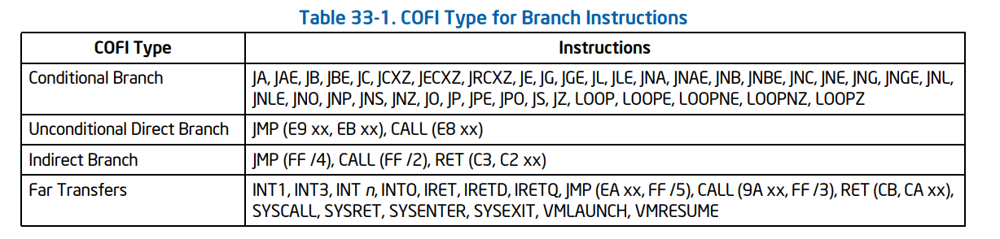
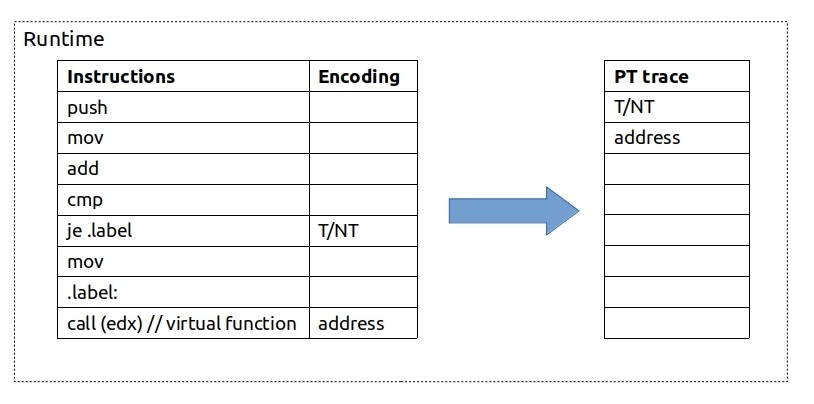
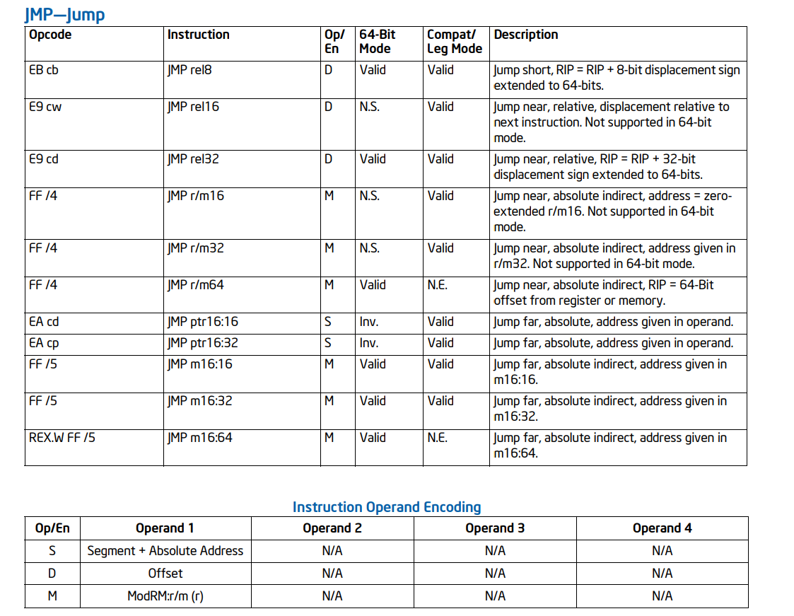
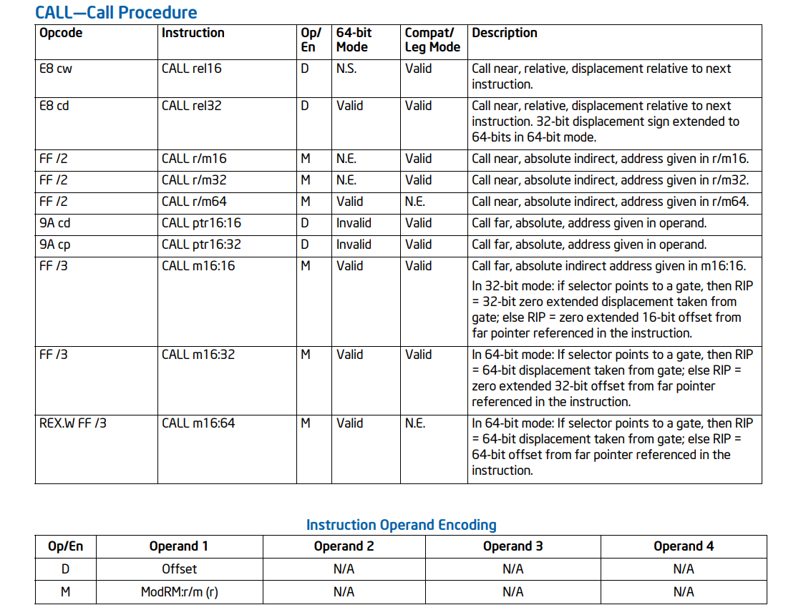

# Intel Processor Trace

Intel® Processor Trace（Intel PT）是Intel® Architecture的扩展，它使用专用硬件设施捕获有关软件执行的信息，对被追踪的软件的性能几乎没有影响。这些信息以数据包的形式收集。Intel PT的初始实现提供了控制流追踪，它生成多种数据包，以供软件解码器处理。这些数据包包括时间、程序流信息（例如，分支目标、分支是否被执行）和程序引起的模式相关信息（例如，Intel TSX状态转换、CR3更改）。这些数据包在发送到内存子系统或平台上可用的其他输出机制之前可能会在内部进行缓冲。 [These packets may be buffered internally before being sent to the memory subsystem or other output mechanism available in the platform.] 调试软件可以处理跟踪数据并重构程序流。

Intel PT的控制流追踪生成多种数据包，与程序的二进制文件结合使用后处理工具可以生成精确的执行跟踪。这些数据包记录了流信息，例如指令指针[instruction pointer]（IP）、间接分支目标和连续代码区域（基本块）中条件分支的方向。

Intel PT还可以配置为使用PTWRITE记录由软件生成的数据包，以及描述处理器功率管理事件的数据包。此外，可以配置精确事件采样（ Precise Event-Based Sampling `PEBS` ）以在Intel PT跟踪中记录PEBS记录；请参阅第20.5.5.2节。

此外，这些数据包还记录了其他上下文、时间和`bookkeeping information`，可用于应用程序的功能和性能的调试。Intel PT具有多种控制和过滤功能，可用于自定义收集的跟踪信息，并附加其他处理器状态和时间信息以实现调试。例如，有一些模式允许根据当前特权级（CPL）或CR3的值对数据包进行过滤。

通过一组MSR编程来配置数据包生成和过滤功能。这些配置MSR通常遵循`IA32_RTIT_*`命名约定。这些配置MSR提供的功能由CPUID枚举，请参阅第33.3节。有关配置Intel PT所需MSR的详细信息，请参阅第33.2.8节。

## Packet Summary

**程序执行流的基本信息包; 它们包括：**

- Packet Stream Boundary (PSB) ：PSB 数据包作为“心跳”定期生成（例如，每 4K 跟踪数据包字节一次）。这些数据包允许分组解码器在输出数据流中找到数据包边界；当开始解码跟踪时，PSB 数据包应该是解码器查找的第一个分组。
- 分页信息分组（PIP）：PIP 记录对 CR3 寄存器所做的修改。这些信息以及操作系统关于每个进程的 CR3 值的信息允许调试器将线性地址归属于它们正确的应用源。
- 时间戳计数器（TSC）分组：TSC 数据包有助于跟踪挂钟时间，并包含一些软件可见时间戳计数器的部分。
- 核总线比率（CBR）分组：CBR 数据包包含核心：总线时钟比率。
- 迷你时间计数器（MTC）分组：MTC packets provide periodic indication of the passing of wall-clock time.
- 循环计数（CYC）分组：CYC 分组显示处理器核心时钟周期之间经过的数量的。
- 溢出（OVF）分组：当处理器经历内部缓冲区溢出导致分组丢失时，会发送 OVF 分组。此分组通知解码器有关丢失的信息，并可帮助解码器响应此情况。

**控制流信息分组：**

- Taken Not-Taken (TNT) 分组：TNT 分组跟踪直接条件分支的“方向”（被选择，或没被选择）。
- Target IP (TIP) 分组：TIP 分组记录间接分支、异常、中断和其他分支或事件的目标 IP。尽管该 IP 值可能通过消除与上一个 IP 匹配的上位字节来进行压缩，但这些分组仍包含了这些 IP，有各种类型的 TIP 分组；它们在第 33.4.2.2 节中有更详细的介绍。
- Flow Update Packets (FUP)：FUP 提供异步事件（中断和异常）的源 IP 地址，以及其他无法从二进制文件中确定源地址的情况。
- MODE 分组：这些分组为解码器提供了重要的处理器执行信息，以便它可以正确地解释反汇编二进制文件和跟踪日志。MODE 分组具有各种格式，指示诸如执行模式（16 位、32 位或 64 位）等详细信息。
  **被插入到软件的分组：**
- PTWRITE(PTW) 分组：分组含传递给PTWRITE指令操作数的值。
  **Packets about processor power management events:**
- MWAIT packets: Indicate successful completion of an MWAIT operation to a C-state deeper than C0.0.
- Power State Entry (PWRE) packets: Indicate entry to a C-state deeper than C0.0.
- Power State Exit (PWRX) packets: Indicate exit from a C-state deeper than C0.0, returning to C0.
- Execution Stopped (EXSTOP) packets: Indicate that soft
  **包含处理器状态值组的分组：**
- Block Begin Packets (BBP)：指示以下组中所持有的状态类型。
- Block Item Packets (BIP)：指示组中所持有的状态值。
- Block End Packets (BEP)：指示当前组的结束。

## Intel Processor Trace Operational Model

### Change of Flow Instruction (COFI) Tracing

一个基本的程序块是一段代码，其中不会发生跳转或分支。处理器将按顺序执行此代码块中的指令，而无需跟踪指令指针（IP），也无需重定向代码流。分支指令和异常或中断等事件可以改变程序流程。这些改变程序流程的指令和事件称为流程改变指令（COFI）。 COFI 可以被分为以下三类：

- Direct transfer COFI.
- Indirect transfer COFI.
- Far transfer COFI.

表格33-1展示了导致跟踪的数据分组生成的COFI事件:



***NOTE:*** 最下方有关于指令的简单补充，来自与Intel文档，可以简单参考下，详细信息请翻阅《Intel软件开发人员手册第二卷》。

#### Direct transfer COFI

Direct transfer COFI 是相对的分支。这意味着它们的目标是一个IP，它距离当前IP的偏移量被嵌入在指令的字节中。由于指令的目标可以通过源汇编获得，所以没有必要在追踪的输出中显示这些指令的目标。条件分支需要显示分支是否被选择。无条件分支不需要在追踪的输出中进行任何的记录。
它们被划分为两个子类别：

- 条件分支（Jcc，J*CXZ）和 LOOP
  在追踪这些指令的类型时，处理器会编码一个单一的位（已选择或没被选择 —— TNT）去表示在这条指令后的程序流。
- Unconditional Direct Jumps [无条件直接跳跃]（JMP, CALL）
  由于无条件直接跳跃指令可以通过应用程序的汇编代码推断，所以对于这类，追踪输出并不记录。无条件直接跳跃不产生任何TNT位或是目标IP数据包。但是通过切换 Intel PT启用无条件直接跳转就可以生成TIP.PGD 和 TIP.PGE数据包。[ Direct unconditional jumps do not generate a TNT bit or a Target IP packet, though TIP.PGD and TIP.PGE packets can be generated by unconditional direct jumps that toggle Intel PT enables ]



#### Indirect Transfer COFI

间接跳转指令涉及从寄存器或是内存区域更新的IP。由于寄存器或内存的内容可能在程序执行期间的任何时刻发生变化，所以在寄存器或内存内容被读取之前是并没有办法知道间接跳转的目标。因此，单靠反汇编代码并不足以确定这种COFI的目标。所以，追踪的硬件必须在追踪的分组中向调试的软件发送目标IP以确定这种COFI的目标地址。注意，这个IP可以是一个线性地址或是实际地址。

例如下面这段nasm格式的汇编代码：

```nasm
mov rax, qword[indirect_address]
jmp [rax]
```

`jmp` 指令将会跳转到 indirect_address 内存中保存的4字的地址。这种方式被称为 `absulote indirect`。

一个间接跳转指令产生一个包含分支的目的地址TIP数据包，它们可以被划分为以下两类：

- 间接 “近” JMP 和 间接 “近” CALL [Near JMP Indirect and Near Call Indirect]

就像之前提到的，一个间接的COFI的目标要么存储在寄存器中，要么就是存储在内存区域中。因此，处理器必须产生一个包含这个目标地址的包，以允许解码器去确定程序流。

- “近”RET

当一个CALL指令被执行，紧随着CALL指令之后的下一条指令会被压入到栈中，在CALL过程完成之前，RET指令经常被用来弹出之前压入到栈中的CALL指令之后的下一条指令的地址，并重新转变程序流以回到CALL指令之后的指令流。

RET指令只是简单地使用从栈中弹出的地址，然后转变程序流。因为在执行CALL的这个过程中，返回地址可能会在RET指令执行之前被更改，所以如果调试软件时假定代码流只是简单的返回到上一次调用CALL指令之前的代码流，则可能会得到错误的结果。因此，哪怕是对于“近”RET，TIP也可能被发送。 

- RET压缩 
  一种特殊的情况是当RET的目标与追踪的CALL栈中预期的结果一致。如果解码器看到了corresponding CALL ( with "corresponding" defined as the CALL with matching stack depth), 并且有把握确定RET的目标是CALL之后的指令，则这个RET目标就可以被“压缩”。在这种情况下，仅仅需要产生一个TNT位来表示“已选择”来替代目标指令指针分组（TIP）。为了确保解码器在RET压缩的情况下不会被混淆，在给定的逻辑处理器中，只有对应于自上一个PSB分组以来已经看到的CALL的RET可以被压缩。

#### Far Transfer COFI

所有可以更改指令指针的操作不是近跳转就是“远跳转”。其中远跳转包括 “异常”，“中断”，“陷阱”，“TSX abort”和进行远转换的指令[instructions that do far transfer]。

所有的远转换[far transfers] 都将会产生一个TIP分组，它提供了目的IP地址。对与那些无法从源二进制文件中推理出来的远转换，在产生TIP之前将会产生一个FUP（Flow Update packet），在事件被采取后，它会提供事件的源IP地址。

### 使用PTWRITE对软件进行追踪检测

PTWRITE

***

## 指令集描述

### JMP



### CALL


