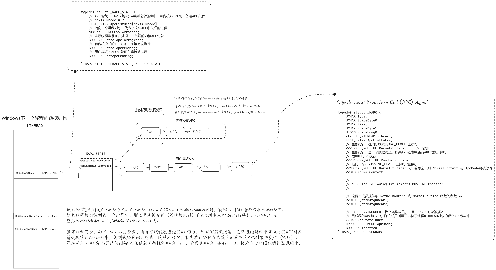

# Asynchronous Procedure Call

## APC对象

IRQL: APC_LEVEL, 位于 PASSIVE_LEVEL 之上， DISPATCH_LEVEL 之下，专门为异步过程调用的软件中断而保留的IRQL。每个APC都是在特定的线程环境中运行的，从而也一定在特定的进程环境中运行。与DPC不同，DPC是系统全局，且每个处理器都有DPC链表，而APC是针对线程的，每个线程都有自己特有的APC链表。同一个线程的APC也是被排队执行的。当一个线程获得控制时，它的APC过程会被立刻执行。
```c
//
//
// Asynchronous Procedure Call (APC) object
//
// N.B. The size of this structure cannot change since it has been exported.
//

typedef struct _KAPC {
    UCHAR Type;
    UCHAR SpareByte0;
    UCHAR Size;
    UCHAR SpareByte1;
    ULONG SpareLong0;
    struct _KTHREAD *Thread;
    LIST_ENTRY ApcListEntry;
    // 函数指针，在内核模式的APC_LEVEL 上执行
    PKKERNEL_ROUTINE KernelRoutine;     // 必需
    // 函数指针，当一个线程终止，如果APC链表中还有APC对象，执行
    // 为NULL，不执行
    PKRUNDOWN_ROUTINE RundownRoutine;
    // 指向一个在PASSIVE_LEVEL 上执行的函数
    PKNORMAL_ROUTINE NormalRoutine; // 若为空，则 NormalContext 与 ApcMode将被忽略
    PVOID NormalContext;

    //
    // N.B. The following two members MUST be together.
    //

    /* 这两个成员提供给 KernelRoutine 或 NormalRoutine 函数的参数 */
    PVOID SystemArgument1;
    PVOID SystemArgument2;

    // KAPC_ENVIRONMENT 枚举类型成员，一旦一个APC对象被插入
    // 到线程的APC链表中，则该成员指示了它位于线程KTHREAD对象的哪个APC链表中。
    CCHAR ApcStateIndex;
    // 后面要根据该成员来确定插入到KAPC_STATE结构中的哪个链表
    KPROCESSOR_MODE ApcMode;
    BOOLEAN Inserted;
} KAPC, *PKAPC, *PRKAPC;
```
```c
typedef enum _KAPC_ENVIRONMENT {
    OriginalApcEnvironment,
    AttachedApcEnvironment,
    CurrentApcEnvironment,
    InsertApcEnvironment
} KAPC_ENVIRONMENT;
```

两种内核模式APC：特殊APC是NormalRoutine为NULL的APC对象，普通则不为NULL，但ApcMode成员为KernelMode。它们共用一个APC链表，但特殊APC位于链表前，普通在后。**普通APC在被交付时，既执行KernelRoutine也执行NormalRoutine。**

```c
typedef struct _KAPC_STATE {
    // APC两个链表头，APC对象将挂载到这两个链表中。且内核APC在前，普通APC在后
    // MaximumMode = 2, 根据APC的ApcMode来决定插入到哪一个链表中。
    LIST_ENTRY ApcListHead[MaximumMode];
    // 指向一个进程对象，代表了这些APC所关联的进程
    struct _KPROCESS *Process;
    // 表示线程当前正在处理一个普通的内核APC对象
    BOOLEAN KernelApcInProgress;
    // 有内核模式的APC对象正在等待被执行
    BOOLEAN KernelApcPending;
    // 用户模式的APC对象正在等待被执行
    BOOLEAN UserApcPending;

} KAPC_STATE, *PKAPC_STATE, *PRKAPC_STATE;
```


```
dt _KTHREAD
    ......
   +0x098 ApcState         : _KAPC_STATE
   +0x098 ApcStateFill     : [43] UChar

   +0x24a ApcStateIndex    : UChar

   ......
   +0x258 SavedApcState    : _KAPC_STATE
   +0x258 SavedApcStateFill : [43] UChar
   ......
```

使用APC链表的是ApcState成员。ApcStateIndex = 0 (OriginalApcEnvironment)时，新插入的APC都被放在ApcState中。如果线程被附载到另一个进程中，那么尚未被交付（等待被执行）的APC对象从ApcState转移到SavedApcState（让SavedApcState.ApcListHead指向ApcState.ApcListHead指向的对象即可）。然后ApcStateIndex = 1 (AttachedApcEnvironment)。需要注意的是，**ApcStateIndex总是索引着当前线程原进程的Apc链表**。所以附载完成后，在新进程环境中要执行的APC对象都会被挂到ApcState中，等到该线程回到它自己的原进程中，首先要让线程在当前的进程中的APC对象被交付（执行），然后将SavedApcState的指向的Apc对象链表重新挂到ApcState中，并设置ApcStateIndex = 0，接着再让该线程回到原进程中。

> Note. 由于ApcStatePointer成员已经在KTHREAD结构中被移除，但其他成员还在，猜测Windows应该是使用了其他方式并根据上面提到的几个成员来进行管理APC（大概叭

**ApcState总是包含了要在当前进程环境中执行的APC对象**

附上一张自己根据自己的理解画的图



## **管理APC**

首先根据 APC 环境设置和ApcStateIndex 成员，确定要插入的目标线程和APC链表；
如果NormalContext为NULL，则该APC为内核模式
```

    if (ARGUMENT_PRESENT(NormalRoutine)) {
        Apc->ApcMode = ApcMode;
        Apc->NormalContext = NormalContext;

    } else {
        Apc->ApcMode = KernelMode;
        Apc->NormalContext = NIL;
    }
```

然后依据不同的情形，插入到APC链表。用户模式的APC插入到用户模式APC链表 ApcListHead[UserMode]中；普通内核模式的APC插入到链表尾；对于特殊内核模式APC，KiInsertQueueApc从链表尾部开始查找，找到第一个NormalRoutine为NULL的APC对象，然后将新插入的APC对象接在它的后面。特殊APC总是在普通APC对象的前面。
```c
VOID
FASTCALL
KiInsertQueueApc (
    IN PKAPC Apc,
    IN KPRIORITY Increment
    )
```

```c
    //
    // Insert the APC after all other special APC entries selected by
    // the processor mode if the normal routine value is NULL. Else
    // insert the APC object at the tail of the APC queue selected by
    // the processor mode unless the APC mode is user and the address
    // of the special APC routine is exit thread, in which case insert
    // the APC at the front of the list and set user APC pending.
    //


    ApcMode = Apc->ApcMode;

    ASSERT (Apc->Inserted == TRUE);

    // 如果NormalRoutine不为NULL，并且ApcMode不为KernelMode，则判断该APC为用户
    // APC，插入ApcListHead[ApcMode]链表头的后面，如果为KernelMode，则插入到链表的末尾。
    if (Apc->NormalRoutine != NULL) {
        if ((ApcMode != KernelMode) && (Apc->KernelRoutine == PsExitSpecialApc)) {
            Thread->ApcState.UserApcPending = TRUE;
            InsertHeadList(&ApcState->ApcListHead[ApcMode],
                           &Apc->ApcListEntry);

        } else {
            InsertTailList(&ApcState->ApcListHead[ApcMode],
                           &Apc->ApcListEntry);
        }

    } else {
        ListEntry = ApcState->ApcListHead[ApcMode].Blink;
        while (ListEntry != &ApcState->ApcListHead[ApcMode]) {
            ApcEntry = CONTAINING_RECORD(ListEntry, KAPC, ApcListEntry);
            if (ApcEntry->NormalRoutine == NULL) {
                break;
            }

            ListEntry = ListEntry->Blink;
        }

        InsertHeadList(ListEntry, &Apc->ApcListEntry);
    }
```
所以，一个线程的两个APC链表，被划分为UserMode KernelMode 两组。其中内核模式APC链表中，特殊内核模式APC在链表的最前面。如果插入的APC的ApcMode为KernelMode，则 设置 Thread->ApcState.KernelApcPending = TRUE;
如果线程是等待的，并且没有禁用内核模式Apc，则调用KiUnwaitThread，该会调用KiReadyThread唤醒该线程。
```
// 省略

if (ThreadState == Running) {
    RequestInterrupt = TRUE;

} else if ((ThreadState == Waiting) &&
            (Thread->WaitIrql == 0) &&
            (Thread->SpecialApcDisable == 0) &&
            ((Apc->NormalRoutine == NULL) ||
            ((Thread->KernelApcDisable == 0) &&
                (Thread->ApcState.KernelApcInProgress == FALSE)))) {

    KiUnwaitThread(Thread, STATUS_KERNEL_APC, Increment);

// 调用门是过时的设计，所以这段代码不研究（
} else if (Thread->State == GateWait) {
    KiAcquireThreadLock(Thread);
    if ((Thread->State == GateWait) &&
        (Thread->WaitIrql == 0) &&
        (Thread->SpecialApcDisable == 0) &&
        ((Apc->NormalRoutine == NULL) ||
            ((Thread->KernelApcDisable == 0) &&
            (Thread->ApcState.KernelApcInProgress == FALSE)))) {

        GateObject = Thread->GateObject;
        KiAcquireKobjectLock(GateObject);
        RemoveEntryList(&Thread->WaitBlock[0].WaitListEntry);
        KiReleaseKobjectLock(GateObject);
        if ((Queue = Thread->Queue) != NULL) {
            Queue->CurrentCount += 1;
        }

        Thread->WaitStatus = STATUS_KERNEL_APC;
        KiInsertDeferredReadyList(Thread);
    }

    KiReleaseThreadLock(Thread);
}
```
如果为UserMode，直接调用KiUnwaitThread。
```c
Thread->ApcState.UserApcPending = TRUE;
KiUnwaitThread(Thread, STATUS_USER_APC, Increment);
```

最后请求一个APC中断。
```c
KiRequestApcInterrupt(Thread->NextProcessor);
```

## APC 交付
APC 对象被插入到线程的APC链表中以后，一旦APC_LEVEL 软件中断发生，或者IRQL从高降低到APC_LEVEL以下，则当前线程的APC被交付。
```c
KiDeliverApc (
    IN KPROCESSOR_MODE PreviousMode,
    IN PKEXCEPTION_FRAME ExceptionFrame,
    IN PKTRAP_FRAME TrapFrame
    )

    // 省略

    //
    // If the thread was interrupted in the middle of the SLIST pop code,
    // then back up the PC to the start of the SLIST pop. 
    //

    if (TrapFrame != NULL) {
        KiCheckForSListAddress(TrapFrame);
    }

    //
    // Save the current thread trap frame address and set the thread trap
    // frame address to the new trap frame. This will prevent a user mode
    // exception from being raised within an APC routine.
    //

    Thread = KeGetCurrentThread();
    OldTrapFrame = Thread->TrapFrame;
    Thread->TrapFrame = TrapFrame;

    //
    // If special APC are not disabled, then attempt to deliver one or more
    // APCs.
    //

    Process = Thread->ApcState.Process;
    Thread->ApcState.KernelApcPending = FALSE;

    // 省略

```
```
如果特殊APC被启用：

    遍历内核模式APC链表

        提升IRQL到DISPATCHER_LEVEL 等级，锁上APC队列
        
        如果内核模式APC队列的APC对象为空
            释放锁，中断循环，去交付user APC
        
        如果NormalRoutine == NULL
            从队列中移除该对象，释放锁，调用KernelRoutine
            等待函数返回，继续执行循环
        否则
            如果该线程并没有在处理一个普通内核APC对象，即线程的ApcState.KernelApcInProgress为False
                从队列中移除该对象，释放锁，调用KernelRoutine
                Thread->ApcState.KernelApcInProgress = TRUE
                降低IRQL为PASSIVE_LEVEL，调用NormalRoutine
                提升IRQL为APC_LEVEL
                Thread->ApcState.KernelApcInProgress = FALSE

    如果PreviousMode == UserMode

        提升IRQL到DISPATCHER_LEVEL 等级，锁上APC队列
        
        如果用户APC队列的APC对象为空
            释放锁, goto CheckProcess
        
        释放锁，交付KernelRoutine

            如果NormalRoutine为空
                调用KeTestAlertThread(UserMode)
            否则
                调用KiInitializeUserApc设置好用户APC例程
                将陷阱帧中的用户模式返回地址设置为KeUserApcDisPatcher
                （找不到该函数，我在Windows10中的ntdll.dll也没找到类似的函数名，可能改名了吧）
                传递NormalRoutine等信息。
设置陷阱帧      
```

用户模式APC的NormalRoutine是一个在用户模式下运行的函数，位于用户地址空间。而KiDeliverApc是在内核模式下运行的，所以KiDeliverApc只是调用KiInitializeUserApc来设置好用户的APC例程将来被调用的环境。
从内核模式到用户模式是通过一个陷阱帧来返回的，所以，KiInitializeUserApc将陷阱帧中的用户模式返回地址EIP寄存器设置为KeUserApcDispatcher函数的地址。
```c
if (NormalRoutine == (PKNORMAL_ROUTINE)NULL) {
    KeTestAlertThread(UserMode);

} else {
    KiInitializeUserApc(ExceptionFrame,
                        TrapFrame,
                        NormalRoutine,
                        NormalContext,
                        SystemArgument1,
                        SystemArgument2);
}
```

APC触发

* 当内核代码离开一个临界区或者守护区(调用`KeLeaveGuardedRegion` 或`KeLeaveCriticalRegion` )时，通过`KiCheckForKernelApcDelivery`函数直接调用`KiDeliverApc`，或者调用`KiRequestSoftwareInterrupt`函数请求一个 APC_LEVEL 的软件中断。这是因为，当线程进入临界区或守护区时，普通内核模式APC或特殊内核模式APC被禁止了，所以，当离开时，`KiCheckForKernelApcDelivery` 函数被调用,以便及时地交付内核模式APC。

* 当一个线程经过一次环境切换而获得控制时，如果有内核模式APC需要被交付,则在`KiSwapThread`函数返回以前，调用`KiDeliverApc`函数交付该内核模式APC。

* **当系统服务或异常处理函数返回到用户模式时**, `KiDeliverApc`函数被调用以便交付用户模式APC。

* 在APC_LEVEL软件中断发生时，HAL模块中的软件中断处理函数( `HalpDispatchSoftwareInterrupt` )调用KiDeliverApc来交付内核模式APC。当内核代码调用KeLowerIrql函数降低IRQL到PASSIVE_LEVEL时，KiDeliverApc 函数也会被调用。

情况四会造成一种很有趣的现象，由于在处理普通内核模式APC时会将IRQL降低为PASSIVE_LEVEL时，这时候KiDeliverApc又会被调用，所以在内核处理普通内核APC的NormalRoutine时的顺序是后进先出。
