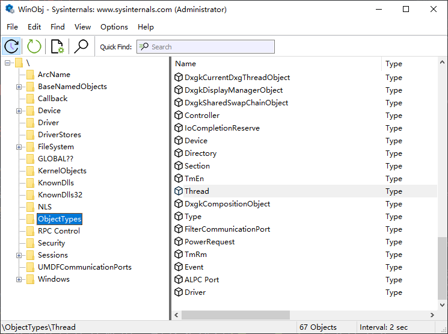
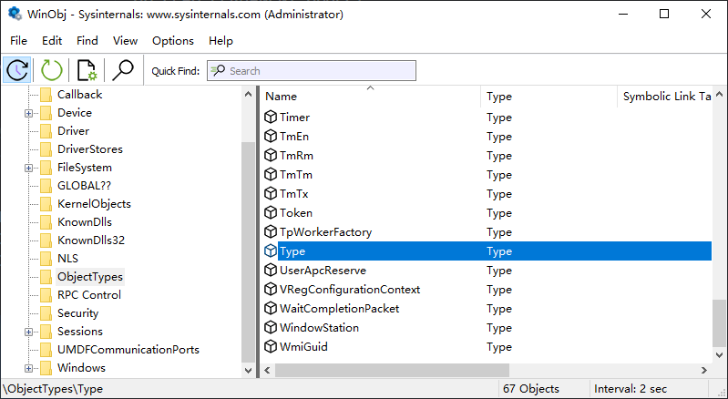

# Windows内核中的对象管理

Windows 内核资源管理采纳了面向对象的思想。Windows 的内核包含执行体(微)内核和 HAL三层对象管理器是执行体中的组件，主要管理执行体对象。但是，执行体对象也可能封装了一个或多个内核对象。

Windows 对象管理器的基本设计意图是(参考 WRK 附带的 NT 设计文档目录
中的ob.doc):

- 为执行体的数据结构提供一种统一而又可扩展的定义和控制机制。

- 提供统一的安全访问机制。

- 在无须修改已有系统代码的情况下，加人新的对象类型。

- 提供一组标准的API来对对象执行各种作。

- 提供一种命名机制，与文件系统的命名机制集成在一起。

与 Windows 的注册表管理类似，Windows内核的对象管理也使用了一种类似于文件管理的设计。微软提供了 Sysinternals 工具集，可以使用 `winobj.exe`程序来查看内核中的对象种类。



Windows将不同类型的对象放在对应的文件夹中，他们都存储在`\`目录当中。例如，一个线程对象`Thread`所在的路径即为`\ObjectType\Thread`。

> 下文的"对象类型"代表`ObjectType`。

Windows定义的对象类型的种类是有限的，对于每种对象类型各有一个全局的`POBJECT_TYPE`变量指向相应的对象类型。Windows内部有一个`_OBJECT_TYPE`类型的结构体数组，对象头通过`TypeIndex`成员来关联对应的对象类型。接下来使用WRK的源码作为例子来描述Windows创建一个对象类型的过程，虽然WRK与现在的Windows有着一定的差别，不过一些设计理念仍然得到了保留。

`_OBJECT_TYPE`结构体信息：

```
0: kd> dt _OBJECT_TYPE
nt!_OBJECT_TYPE
UnKnown Windows10内核中的Process对象成员是这样的 
_LIST_ENTRY [ 0xffffc70a`808eb140 - 0xffffc70a`808eb140 ]
   +0x000 TypeList         : _LIST_ENTRY
对象名
   +0x010 Name             : _UNICODE_STRING
//  If we are to use the default object (meaning that we'll have our
//  private event as our default object) then the type must allow
//  synchronize and we'll set the default object
   +0x020 DefaultObject    : Ptr64 Void
// 与之关联的对象类型在全局对象类型数组中的索引
   +0x028 Index            : UChar
   +0x02c TotalNumberOfObjects : Uint4B
   +0x030 TotalNumberOfHandles : Uint4B
   +0x034 HighWaterNumberOfObjects : Uint4B
   +0x038 HighWaterNumberOfHandles : Uint4B
// 指向 _OBJECT_TYPE_INITIALIZER 结构体指针
   +0x040 TypeInfo         : _OBJECT_TYPE_INITIALIZER
   +0x0b8 TypeLock         : _EX_PUSH_LOCK
   +0x0c0 Key              : Uint4B
   +0x0c8 CallbackList     : _LIST_ENTRY
```


Windows使用了`ObCreateObjectType`来新建一个对象类型。下面展示了`ObCreateObjectType`函数的原型：

```c
// WRK/base/ntos/ob/obtype.c 86~495
NTSTATUS
ObCreateObjectType (
    __in PUNICODE_STRING TypeName,
    __in POBJECT_TYPE_INITIALIZER ObjectTypeInitializer,
    __in_opt PSECURITY_DESCRIPTOR SecurityDescriptor,
    __out POBJECT_TYPE *ObjectType
    )
```

对`TypeName`, `ObjectTypeInitializer`进行检查。如果是无效的类型就返回错误。接着Windows确保对象类型名字中并不包含路径分隔符，否则返回`STATUS_OBJECT_NAME_INVALID`。

如果该对象类型名字已经在`\ObjectType\`目录中存在，就报错。相关代码如下：
```c
ObpInitializeLookupContext( &LookupContext );

// ObpTypeDirectoryObject 是一个全局指针，指向了一个目录对象，该目录名为 ObjectType。
if (ObpTypeDirectoryObject) {

   ObpLockLookupContext( &LookupContext, ObpTypeDirectoryObject);

   // ObpLookupDirectoryEntry() 函数在 ObpTypeDirectoryObject指向的目录中查找
   // 如果在该目录中找到了一个对象类型的名字为调用 ObCreateObjectType时传入的 TypeName
   // 的对象类型，说明创建了一个冲突的对象类型，ObCreateObjectType返回 
   // STATUS_OBJECT_NAME_COLLISION
   if (ObpLookupDirectoryEntry( ObpTypeDirectoryObject,
                                 TypeName,
                                 OBJ_CASE_INSENSITIVE,
                                 FALSE,
                                 &LookupContext )) {

      ObpReleaseLookupContext( &LookupContext );

      return( STATUS_OBJECT_NAME_COLLISION );
   }
}
```

接下来，Windows会使用`ObpAllocateObject`为该类型分配一个对象类型，该对象的对象体为`_OBJECT_TYPE`。

```c
Status = ObpAllocateObject( NULL,
                            KernelMode,
                            ObpTypeObjectType,
                            &ObjectName,
                            sizeof( OBJECT_TYPE ),
                            &NewObjectTypeHeader );
```

接着，Windows初始化这个对象。

`ObpTypeObjectType` 是一个全局变量，指向一个类型名为`Type`的对象类型。这种情况发生在Windows系统初始化的阶段。Windows创建的第一个ObjectType目录中的对象类型应该为 Type 对象类型。此时 ObpTypeObjectType 的值应为 NULL，所以本次的条件判断成立，Windows将`ObpTypeObjectType`指针指向新创建的对象类型`Type`。可以在 winobj 程序中查看关于该对象类型的信息：



```c
    //
    //  If there is not a type object type yet then this must be
    //  that type (i.e., type object type must be the first object type
    //  ever created.  Consequently we'll need to setup some self
    //  referencing pointers.
    //

    if (!ObpTypeObjectType) {

        ObpTypeObjectType = NewObjectType;
        NewObjectTypeHeader->Type = ObpTypeObjectType;
        NewObjectType->TotalNumberOfObjects = 1;

    } 
```

否则的话就继续初始化本次创建的对象类型，设置新创建的对象类型的Key成员，该成员是一个四字节的数字(为该对象类型的前4个ASCII码字符)

```c
//
//  Otherwise this is not the type object type so we'll
//  try and generate a tag for the new object type provided
//  pool tagging is turned on.
//

ANSI_STRING AnsiName;

if (NT_SUCCESS( RtlUnicodeStringToAnsiString( &AnsiName, TypeName, TRUE ) )) {

   for (i=3; i>=AnsiName.Length; i--) {

         AnsiName.Buffer[ i ] = ' ';

   }

   NewObjectType->Key = *(PULONG)AnsiName.Buffer;
   ExFreePool( AnsiName.Buffer );

} else {

   NewObjectType->Key = *(PULONG)TypeName->Buffer;
}
```

下面展示了Process对象的Key成员：

```
+0x0c0 Key              : 0x636f7250
```

就是ASCII字符'Proc'。接着初始化新对象类型的TypeInfo成员。

```c
//
//  Continue initializing the new object type fields
//

NewObjectType->TypeInfo = *ObjectTypeInitializer;
NewObjectType->TypeInfo.PoolType = PoolType;

if (NtGlobalFlag & FLG_MAINTAIN_OBJECT_TYPELIST) {

    NewObjectType->TypeInfo.MaintainTypeList = TRUE;
}
```

下面是`_OBJECT_TYPE_INITIALIZER`的结构体信息：

```
0: kd> dt _OBJECT_TYPE_INITIALIZER
nt!_OBJECT_TYPE_INITIALIZER
   +0x000 Length           : Uint2B
   +0x002 ObjectTypeFlags  : Uint2B
   +0x002 CaseInsensitive  : Pos 0, 1 Bit
   +0x002 UnnamedObjectsOnly : Pos 1, 1 Bit
   +0x002 UseDefaultObject : Pos 2, 1 Bit
   +0x002 SecurityRequired : Pos 3, 1 Bit
   +0x002 MaintainHandleCount : Pos 4, 1 Bit
   +0x002 MaintainTypeList : Pos 5, 1 Bit
   +0x002 SupportsObjectCallbacks : Pos 6, 1 Bit
   +0x002 CacheAligned     : Pos 7, 1 Bit
   +0x003 UseExtendedParameters : Pos 0, 1 Bit
   +0x003 Reserved         : Pos 1, 7 Bits
   +0x004 ObjectTypeCode   : Uint4B
   +0x008 InvalidAttributes : Uint4B
   +0x00c GenericMapping   : _GENERIC_MAPPING
   +0x01c ValidAccessMask  : Uint4B
   +0x020 RetainAccess     : Uint4B
   +0x024 PoolType         : _POOL_TYPE
   +0x028 DefaultPagedPoolCharge : Uint4B
   +0x02c DefaultNonPagedPoolCharge : Uint4B
   +0x030 DumpProcedure    : Ptr64     void 
   +0x038 OpenProcedure    : Ptr64     long 
   +0x040 CloseProcedure   : Ptr64     void 
   +0x048 DeleteProcedure  : Ptr64     void 
   +0x050 ParseProcedure   : Ptr64     long 
   +0x050 ParseProcedureEx : Ptr64     long 
   +0x058 SecurityProcedure : Ptr64     long 
   +0x060 QueryNameProcedure : Ptr64     long 
   +0x068 OkayToCloseProcedure : Ptr64     unsigned char 
   +0x070 WaitObjectFlagMask : Uint4B
   +0x074 WaitObjectFlagOffset : Uint2B
   +0x076 WaitObjectPointerOffset : Uint2B
```

可以看出，在调用 ObCreateObjectType 函数来构建一种新的对象类型时，调用者除了可以指定此种类型对象的一些数据特性以外，还可以指定该类型对象的一些基本操作方法，包括 Dump、Open、Close、Delete、Parse、Security、QueryName 和OkayToClose。对象管理器正是通过这些方法来统一管理各种类型的对象的。

系统有一个全局变量ObpObjectTypes 数组记录了所有已创建的类型，这是一个静态数组，WRK 限定不超过 48 种对象类型。`_OBJECT_TYPE` 中的 `Index` 成员记录了一个类型对象在此数组中的索引。

下面这段代码我并不是很明白，感兴趣的可以了解一下

```c
//
//  If we are to use the default object (meaning that we'll have our
//  private event as our default object) then the type must allow
//  synchronize and we'll set the default object
//

if (NewObjectType->TypeInfo.UseDefaultObject) {

    NewObjectType->TypeInfo.ValidAccessMask |= SYNCHRONIZE;
    NewObjectType->DefaultObject = &ObpDefaultObject;

//
//  Otherwise if this is the type file object then we'll put
//  in the offset to the event of a file object.
//

} else if (ObjectName.Length == 8 && !wcscmp( ObjectName.Buffer, L"File" )) {

    NewObjectType->DefaultObject = ULongToPtr( FIELD_OFFSET( FILE_OBJECT, Event ) );


//
// If this is a waitable port, set the offset to the event in the
// waitableport object.  Another hack
//

} else if ( ObjectName.Length == 24 && !wcscmp( ObjectName.Buffer, L"WaitablePort")) {

    NewObjectType->DefaultObject = ULongToPtr( FIELD_OFFSET( LPCP_PORT_OBJECT, WaitEvent ) );

//
//  Otherwise indicate that there isn't a default object to wait
//  on
//

} else {

    NewObjectType->DefaultObject = NULL;
}
```

接着就是将该对象类型存储到全局对象类型数组里面：

```c
//
//  Store a pointer to this new object type in the
//  global object types array.  We'll use the index from
//  the type object type number of objects count
//

NewObjectType->Index = ObpTypeObjectType->TotalNumberOfObjects;

if (NewObjectType->Index < OBP_MAX_DEFINED_OBJECT_TYPES) {

    ObpObjectTypes[ NewObjectType->Index - 1 ] = NewObjectType;
}
```

在WRK中`OBP_MAX_DEFINED_OBJE` 的值为 48，现在的Windows很可能已经改变。

最后，如果`ObpTypeDirectoryObject`全局变量为NULL，则直接将新创建的对象类型赋值给 `_out_ ObjectType` 参数，接着返回`STATUS_SUCCESS`。如果成功将新建的对象类型插入到`\ObjectType\`目录中，那么同样指向上述的过程。最后，`ObCreateObjectType`的调用者就可以使用`ObjectType`来引用新创建好的对象类型了。

否则，创建失败，返回 `STATUS_INSUFFICIENT_RESOURCES`。

```c
//
//  Lastly if there is not a directory object type yet then the following
//  code will actually drop through and set the output object type
//  and return success.
//
//  Otherwise, there is a directory object type and we try to insert the
//  new type into the directory.  If this succeeds then we'll reference
//  the directory type object, unlock the root directory, set the
//  output type and return success
//

if (!ObpTypeDirectoryObject ||
    ObpInsertDirectoryEntry( ObpTypeDirectoryObject, &LookupContext, NewObjectTypeHeader )) {

    if (ObpTypeDirectoryObject) {

        ObReferenceObject( ObpTypeDirectoryObject );
    }

    ObpReleaseLookupContext( &LookupContext );

    *ObjectType = NewObjectType;

    return( STATUS_SUCCESS );

} else {

    //
    //  Otherwise there is a directory object type and
    //  the insertion failed.  So release the root directory
    //  and return failure to our caller.
    //

    ObpReleaseLookupContext( &LookupContext );

    return( STATUS_INSUFFICIENT_RESOURCES );
}
```


Windows中的每个对象都有两部分构成：对象头和对象体。

```
0: kd> dt _OBJECT_HEADER
nt!_OBJECT_HEADER
该对象的引用计数
   +0x000 PointerCount     : Int8B
指向该对象的句柄数
   +0x008 HandleCount      : Int8B
对象被延迟删除时加入到的一条链中
   +0x008 NextToFree       : Ptr64 Void
推锁
   +0x010 Lock             : _EX_PUSH_LOCK
该成员用来关联该对象对应的对象类型
   +0x018 TypeIndex        : UChar
   +0x019 TraceFlags       : UChar
   +0x019 DbgRefTrace      : Pos 0, 1 Bit
   +0x019 DbgTracePermanent : Pos 1, 1 Bit
   +0x01a InfoMask         : UChar
   +0x01b Flags            : UChar
   +0x01b NewObject        : Pos 0, 1 Bit
是否为内核对象
   +0x01b KernelObject     : Pos 1, 1 Bit
   +0x01b KernelOnlyAccess : Pos 2, 1 Bit
   +0x01b ExclusiveObject  : Pos 3, 1 Bit
   +0x01b PermanentObject  : Pos 4, 1 Bit
   +0x01b DefaultSecurityQuota : Pos 5, 1 Bit
   +0x01b SingleHandleEntry : Pos 6, 1 Bit
   +0x01b DeletedInline    : Pos 7, 1 Bit
   +0x01c Reserved         : Uint4B
对象的创建信息
   +0x020 ObjectCreateInfo : Ptr64 _OBJECT_CREATE_INFORMATION
   +0x020 QuotaBlockCharged : Ptr64 Void
安全描述符
   +0x028 SecurityDescriptor : Ptr64 Void
对象体开始
   +0x030 Body             : _QUAD
```
我们以Windows新建一个执行体线程的对象来描述这个过程：
```c
Status = ObCreateObject (PreviousMode,
                            PsThreadType,
                            ObjectAttributes,
                            PreviousMode,
                            NULL,
                            sizeof(ETHREAD),
                            0,
                            0,
                            &Thread);
```
下面展示了WRK中的`ObpCreateObject`函数原型：

```c
// WRK/base/ntos/ob/obcreate.c 70~278
NTSTATUS
ObCreateObject (
    __in KPROCESSOR_MODE ProbeMode,
    __in POBJECT_TYPE ObjectType,
    __in POBJECT_ATTRIBUTES ObjectAttributes,
    __in KPROCESSOR_MODE OwnershipMode,
    __inout_opt PVOID ParseContext,
    __in ULONG ObjectBodySize,
    __in ULONG PagedPoolCharge,
    __in ULONG NonPagedPoolCharge,
    __out PVOID *Object
    )
```

首先分配一个对象创建信息(ObjectCreateInfo)的缓冲区对象`ObjectCreateInfo`，如果指定了`object attributes`, `quality of service`, `object name`，就存储这些信息到缓冲区对象中，否则初始化`object name`, `security quality of service`，`create attributes` 为默认值。具体做法就是调用了`ObpCaptureObjectCreateInformation()`，接着根据 `PagedPoolCharge`和`NonPagedPoolCharge`参数来初始化`ObjectCreateInfo`，如果没有指定这两个参数就使用`ObjectType::TypeInfo`提供的默认值。

接着调用`ObpAllocateObject()`：

```c
//
//  Allocate and initialize the object.
//

Status = ObpAllocateObject( ObjectCreateInfo,
                            OwnershipMode,
                            ObjectType,
                            &CapturedObjectName,
                            ObjectBodySize,
                            &ObjectHeader );
```

下面展示了WRK中的`ObpAllocateObject`函数原型：

```c
// WRK/base/ntos/ob/obcreate.c 804~1160
NTSTATUS
ObpAllocateObject (
    IN POBJECT_CREATE_INFORMATION ObjectCreateInfo,
    IN KPROCESSOR_MODE OwnershipMode,
    IN POBJECT_TYPE ObjectType OPTIONAL,
    IN PUNICODE_STRING ObjectName,
    IN ULONG ObjectBodySize,
    OUT POBJECT_HEADER *ReturnedObjectHeader
    )
```

该函数首先计算可选头组件的大小，将传入到ObCreateObject函数的参数的值赋值给ObjectCreateInfo，根据该变量来计算，具体代码看WRK，不展开细讲。由于`_OBJECT_HEADER`结构体在现在的Windows内核中与WRK源码中变化较大。所以只描述该函数的基本逻辑：它首先计算需要分配的空间大小，其中该函数最少分配的大小为`sizeof(_OBJECT_HEADER) + ObjectBodySize`。值得注意的是，这块空间是连续的。所以假设我们新建了一个`_ETHREAD` 对象，那么它在内存中的信息应该是这样的：


```c
*Object = &ObjectHeader->Body;
```

接着，ObCreateObject函数登记了新建的对象，最后返回。

```c
//
//  Register the object and push stack information for the
//  first reference
//

ObpRegisterObject( ObjectHeader );
ObpPushStackInfo( ObjectHeader, TRUE );
```
接着，Windows就可以使用`Thread`变量来引用新建的这个对象了。

对象管理器提供了一些基本的操作用于在名字空间中插入、查询和删除目录或目录项。例如，ObpLookupDirectoryEntry 函数的功能是，在一个指定的目录中查找一个名称; ObpInsertDirectoryEntry 函数把一个对象插人到一个目录中;ObpDeleteDirectoryEntry函数删除刚刚找到的那一项。这三个函数都直接在一个子目录中进行操作。另外有一个重要的操作是 ObpLookupObjectName，它可以从指定的目录或根目录，递归地根据名称来找到一个对象。

前面提到过，内核代码在创建对象类型时，可以为新的对象类型指定 Parse 方法。每一种对象都可以有它自己的名称解析方法，这使得 Windows 的名字系统非常强大，既允许以基本的目录方法来管理名称的层次结构也允许特定类型的对象有它自己的命名和解析策略。如，文件(File)对象有它自己的 Parse 方法，从而可以方便地支持我们所熟悉的文件系统中的目录结构。

对象管理器中的对象是执行体对象，它们位于系统地址空间中，因而所有的进程都可以访问这些对象。但是，在进程地址空间中运行的用户模式代码不能用指针的方式来引用这些对象，它们在调用系统服务时只能通过句柄来引用执行体对象。句柄是进程范畴的概念，它一定要在特定的进程环境中才有意义。在内核中，将一个句柄转换成对应的对象，可以通过 ObReferenceObjectByHandle 函数(在 basentosloblobref.c)来完成该函数负责从当前进程环境或内核环境的句柄表中获得指定的对象引用。

对象是通过引用计数来管理其生命周期的，一旦引用计数为零，则对象的生命周期结束，它所占用的内存也可以被回收。对象的引用计数来源于两个方面。第一个来源是内核中的指针引用。一旦内核中新增了一个对象的引用，则对象的引用计数需要增一; 如果一个对象的引用不再有用，则引用计数减一。这两种作用是在 ObReferenceObjectByPointer 和 ObDereferenceObiect 函数中完成的。第二个来源是，一个进程打开一个对象并获得个句柄，它以后通过此句柄来引用此对象。对象头信息中准确地记录了有多少个句柄指向此对象，当一个句柄不再被使用时，其句柄计数减一。这两种作用是在函数 ObpIncrementHandleCount 和 ObpDecrementHandleCount 中完成的。有关 Windows句柄的介绍将放在下一节。