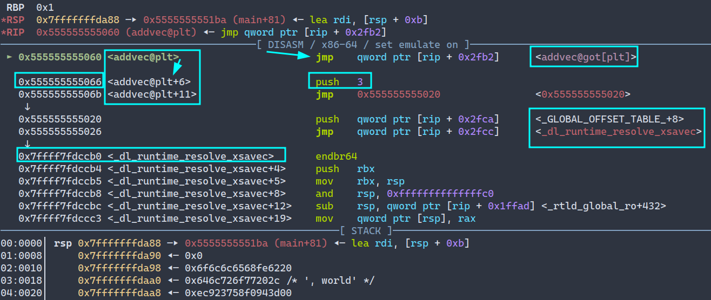
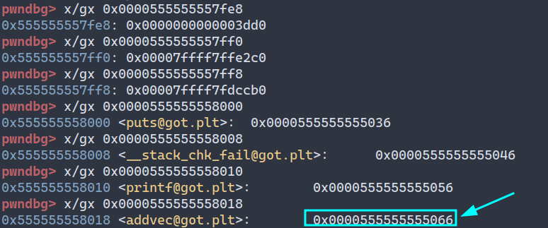

# Lazy Binding

## 让我们开始吧！

上图为main函数的汇编。我们在 call addvec处打上断点，然后运行程序。使用si来进入addvec函数内部

上图有许多需要注意的地方，不过在此之前，让我们先来了解 `addvec@got[plt]` 这个陌生的信息。

* 过程链接表(PLT)。 PLT是一个数组，其中每个条目都是**16字节**代码。**PLT[0] 是一个特殊条目，它跳转到动态链接器中**。每个被可执行程序调用的库函数都有它自己的PLT条目。每个条目都负责调用一个具体的函数。

* 全局偏移量表(GOT)。GOT是一个数组，其中每个条目是8字节地址。和PLT联合使用时即是（`.got.plt`) ，GOT[0]和GOT[1] 包含动态链接器在解析函数地址时会使用的信息。GOT[2]是动态链接器在 `ld-linux.so` 模块的入口点。其余的每个条目对应一个被调用的函数，其地址需要在运行时被解析。每个条目都有一个相匹配的PLT条目。PLT[4] 和 GOT[6] 对应于 `addvec` 函数。初始时，每个GOT条目都指向对应的PLT条目的第二条指令。

注意到这个细节是很重要的：**.plt 在代码段中，.got在数据段中**

通过下面的命令您可以看到 `.plt` `.got` `.got.plt` 存放在内存中的位置。

> info files

程序中还有其他重要的节，不过在讨论它们之前让我们先来关注上面的三个。

上面展示了`.plt`节中存储的所有内容。其中方框的四个就是程序需要使用的函数。`addvec` 函数存储在 PLT[4] 的位置。

那么`.got.plt`呢？

存储`addvec`的位置为`0x0000555555558018`，函数地址就存放在GOT[6]中。内容是 `0x0000555555555066` 。对，当我们第一次调用 addvec 函数时，第一条jmp指令的跳转地址也是 `0x0000555555555066` 。也就是上文提到的 **初始时，每个GOT条目都指向对应的PLT条目的第二条指令。**

## 让我们继续回到第一幅图

到目前为止，我们知道了当第一次调用函数时，程序跳转到PLT节中，这个节存储了第一次调用某个函数时应该跳转到的地址。在我们的例子中就是PLT[4]，这个值是 `0x555555555060`

我们已经看到main函数第一次调用addvec时，程序跳转到了PLT[4]也就是调用 addvec 函数时应该跳转的地方。再然后，程序又通过jmp指令跳转到了 `<addvec@got[plt]> `地址。也就是`.got.plt` 节中存放的`addvec`函数的地址。由于每个GOT条目初始时都指向它对应的PLT条目的第二条指令，这个间接跳转只是简单地把控制传送回 PLT[4] 中的下一条指令，即 

push 3 是一条汇编指令，它将立即数值 3 压入堆栈。在这个上下文中，push 3 指令用于将 addvec 函数的 GOT 索引压入堆栈。这样，在解析器被调用时，它就可以从堆栈中获取这个索引，并使用它来更新 addvec 函数在 GOT 中的地址。

**那么，为什么是 3 呢？**

把主程序需要调用的4个外部函数再分为一组，3刚好就是 第四个函数 addvec 的索引。类似的，如果我们要调用 puts 函数，那么就是 0 。这是动态链接过程的一部分，它允许程序在运行时解析外部函数的地址。

如果把.rela.plt的内容看作一个结构数组，那么3就是对addvec的索引。您可以通过下面的命令来查看这个节的内容。

> readelf -aW prog2l

让我们再执行两次 si

请观察下面这条指令
>  jmp    0x555555555020

jmp跳转到的这个地址不就是 上文中我们看到的 .plt 节的地址吗，对应的是 PLT[0]。

继续执行我们会看到。PLT[0] 通过 GOT[1] 间接地把动态链接器的一个参数压入到栈中，然后通过 GOT[2] 间接跳转进动态链接器中。

这个参数就是：`<_GLOBAL_OFFSET_TABLE_+8>` 对应的就是 `.got.plt` 节中的第二个成员(GOT[1]) 。

通过上文中我们展示的.got.plt节的条目，我们也可以看到这个  _dl_runtime_resolve_xsavec 

函数的地址。

动态链接器使用两个栈条目来确定 addvec 的运行时地址。

## 那么，它是如何确定的呢？

我们可以看到 push把 `0x7ffff7ffe2c0` 压入到栈中。这个地址指向的值为 `0x555555554000`

通过`_dl_runtime_resolve_xsavec` 的汇编代码我们可以看到，它调用了 _dl_fixup 函数，这个函数通过我们传入的参数来进行重定位工作。我们忽略这个函数，_dl_runtime_resolve函数的这段汇编代码就是保存寄存器的值到栈中，然后调用_dl_fixup执行具体的功能，然后从栈中恢复寄存器。_dl_fixup函数传入的两个参数一个是rdi寄存器中存储的link_map，rsi是GOT表中关于PLT重定位的索引值，后面要根据该索引值写入新的地址。

[_dl_fixup()函数行为分析](_dl_fixup.md)

得到了函数的真实地址后，程序会再次调用这个 addvec 函数，由于已经得到了函数的真实地址，所以这次调用将会成功。
