# _dl_fixup(struct link_map *l, ElfW(Word) reloc_arg)

在开始分析前，您需要结合着下文的定义一起看，如果您遇到不理解的地方，它们一般在下文中都给出了链接。

我们知道，我们创建了一个动态库，动态库里面包含了addcnt 和 multcnt两个全局变量和addvec multvec两个函数，程序调用了addvec函数，本篇的目的就是研究动态链接器如何找到addvec函数。

## 开始分析

温馨提示：您可以通过下面这条命令来查看我们传入的参数的结构。

> p /x *l

```c
  const ElfW(Sym) *const symtab
    = (const void *) D_PTR (l, l_info[DT_SYMTAB]);
```

先来观察这一行，我会对这行的代码详细拆解

**ElfW(Sym)**

`ElfW` 是一个宏，用于定义 ELF 文件格式中的符号表条目类型。它是一个结构体类型，其定义取决于目标体系结构。例如，在 32 位体系结构上，`ElfW(Sym)` 等同于 `Elf32_Sym`；而在 64 位体系结构上，`ElfW(Sym)` 等同于 `Elf64_Sym`。`ElfW` 宏用于根据目标体系结构选择正确的 ELF 类型。它可以用于定义各种 ELF 类型，如 `ElfW(Addr)`、`ElfW(Off)`、`ElfW(Half)` 等。

所以，在 64 位机器上，Elfw(Sym) 就等于 Elf64_Sym

```c
#define D_PTR(map, i)  
   ((map)->i->d_un.d_ptr + (dl_relocate_ld (map) ? 0 : (map)->l_addr))

static inline bool dl_relocate_ld (const struct link_map *l)
{
        /* Don't relocate dynamic section if it is readonly  */
        return !(l->l_ld_readonly || DL_RO_DYN_SECTION);

}
```

**D_PTR**

D_PTR 是一个 C 语言宏定义。它定义了一个名为 `D_PTR` 的宏，该宏接受两个参数，`map` 和 `i`。该宏展开为一个表达式，该表达式访问由 `map` 指向的结构的第 `i` 个元素的 `d_un.d_ptr` 字段。如果 `dl_relocate_ld(map)` 为真，则表达式将此值加上 0，否则将其加上由 `map` 指向的结构的 `l_addr` 字段的值。

**l_info**

是`l` 中的一个成员，由于定义太长，再接下来的阅读之前，您可以对着下文给出的link_map定义一起看。

我们知道，我们在调用这个函数之前传入了两个参数，其中第一个参数就是一个地址，这个地址指向的值正是 `0x555555554000` ，您可以用 `p /x l->l_addr` 这个命令在gdb中验证。

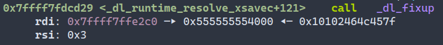

**继续分析这条语句**

在函数的汇编代码中，有这么一行

```nasm
mov    rax, qword ptr [rdi + 0x70]
```

它把我们传入的地址`0x7ffff7ffe2c0`+`0x70` 的地址复制到 rax中

为什么是 +0x70 呢？

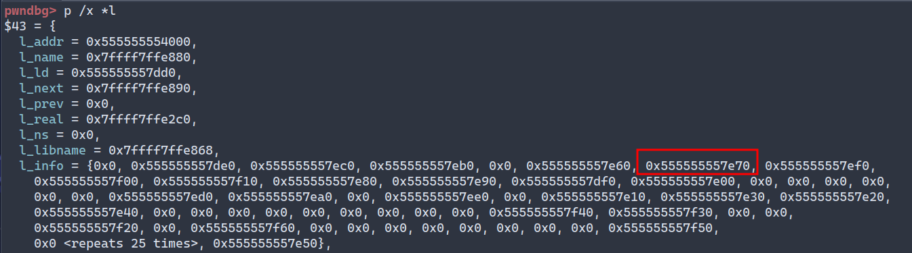

这个结构中每每个成员的大小都是8字节，您暂时可以把它们当作一个long 数组，

0x70 / 0x8 = E，而`l[14]` 刚好就是这个值  `0x555555557e70`  此时 rax 存储的就是 l->l_info[6] 的地址。

我们传入的参数是一个指向 link_map 结构的地址，也就是全局偏移量表(GOT)的第二个成员。这个结构体包含了一些我们需要重定位时需要用到的信息。DT_SYMTAB 是linux定义的索引，linux规定elf文件的格式，并定义了一系列索引，下文有它全部的索引。

```c
#define DT_STRTAB    5        /* Address of string table */
#define DT_SYMTAB    6        /* Address of symbol table */
```

l_info 保存了我们需要调用的 addvec函数需要用到的所有信息，比如 I_info[DT_SYMTAB]存储了一个地址，这个地址指向了.dynamic节中 .dynsym 的信息，下文有关于 .dynamic 节的结构的介绍。

请您观察 rax 的内容

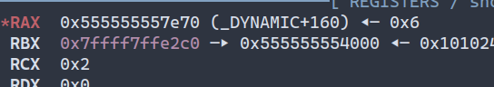

_DYNAMIC 就是 .dynamic 节的起始地址，每个Elf64_Dyn的大小是 16个字节，那么+160

正好就是这个数据结构的第11个成员，这个成员的信息如下。

```
linux> readelf -d -W prog2l | grep "SYMTAB"

Dynamic section at offset 0x2dd0 contains 27 entries:
  Tag        Type                         Name/Value

0x0000000000000006 (SYMTAB)                0x3e0
```

rax 指向了一个 Elf64_Dyn 结构有关这个结构的介绍您可以在下文找到，内容如下

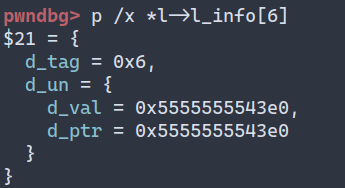

```nasm
mov   r10, qword ptr [rax + 8]
```

紧接着是这条指令，这条指令将 rax+8的地址的内容复制到 r10中，对应的C代码就是

```c
ElfW64_Sym * symtab = l->l_info[6]->d.un.d_ptr;
// 把结构中存储的地址复制到 symtab变量中，这个地址就是 .dynsym节的地址
```

注意，我们传入的第一个参数是一个指向 link_map 结构的地址，这个结构的第一个成员是

[ElfW](https://codebrowser.dev/glibc/glibc/elf/link.h.html#30)(Addr) l_addr // 有关这个成员的信息请您查看下文中给出的源代码的链接

l_addr 的地址是 0x555555554000 ，观察上文的 Dynamic，我们得到的Name/Value 这个值是 0x3e0， 而 0x555555554000+0x3e0 刚好就是 symtab 的地址 0x5555555543e0，此外，这个地址也正式 .dynsym 节的起始地址。

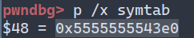

**至此，我们对第一行代码的作用已经彻底的分析完毕**

```c
  const ElfW(Sym) *const symtab
    = (const void *) D_PTR (l, l_info[DT_SYMTAB]);
```

用一句话总结就是它通过我们传入的参数，来找到dynamic节中的 .dynsym 的起始地址。

接下来的这句代码与第一条代码的功能类似。只不过是用来找到  .dynstr 的起始地址。

```c
const char *strtab = (const void *) D_PTR (l, l_info[DT_STRTAB]);
```

执行完上面的语句我们可以得到 strtab的值，这个值就是 .dynstr节的起始地址

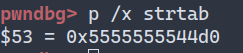

```c
const uintptr_t pltgot = (uintptr_t) D_PTR (l, l_info[DT_PLTGOT]);
```

这行代码用来找到 .got.plt 节的起始地址

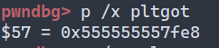

```c
  const PLTREL *const reloc
    = (const void *) (D_PTR (l, l_info[DT_JMPREL])
              + reloc_offset (pltgot, reloc_arg));
  // PLTREL 在 x64 系统中就是 Elf64_Rela
```

接下来这行代码也是类似的，不过它是用来找到 .rela.plt 节的地址，并给它加上我们的偏移量 3, 最后得到的是保存addvec函数重定位条目的结构的地址。我们得到的值是`0x5555555546f8`   `0x5555555546f8 - 0x00005555555546b0（.rela.plt节的起始地址) = 0x48`  每个 Elf64_Rela 的结构的大小是 24个字节，转换成十六进制就是 0x18

所以，0x48 / 0x18 = 3 也就是我们传入的第二个参数 3

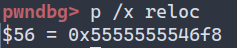

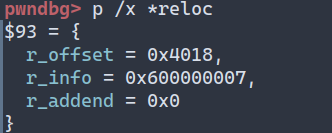

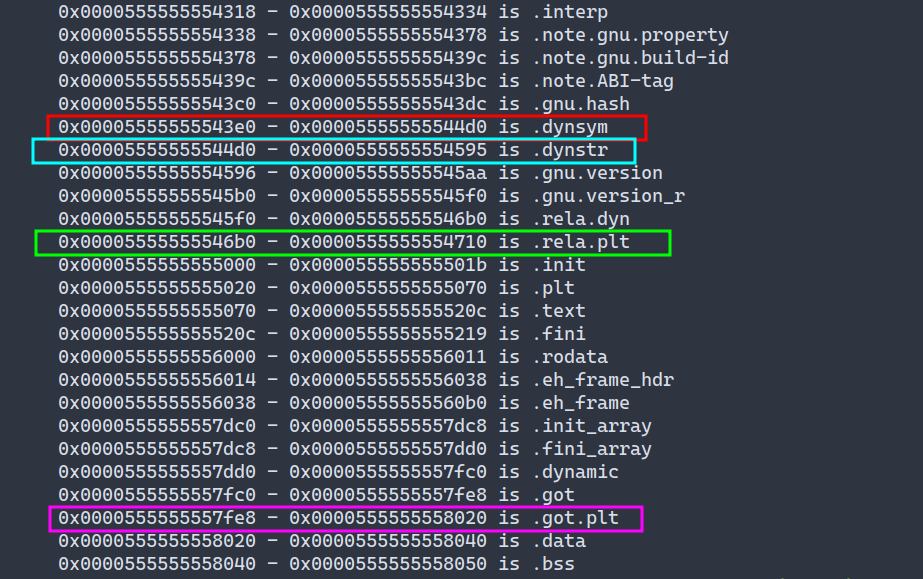

`reloc->r_offset` 的值为 0x4018， 加上 l->addr的值正是 .got.plt 节中存储的addvec的地址，函数要利用这个地址，对这个地址上保存的值进行重写，来让程序找到真正的addvec的地址。

**上面的框框就是我们分析了一大圈最终得到的东西**

让我们继续吧！

```c
  const ElfW(Sym) *sym = &symtab[ELFW(R_SYM) (reloc->r_info)];
  const ElfW(Sym) *refsym = sym;
  void *const rel_addr = (void *)(l->l_addr + reloc->r_offset);
```

紧接着的这几行代码，`ELFW(R_SYM) (reloc->r_info)` 计算出重定位项对应的符号表索引。您可能会纳闷 ELFW(R_SYM) (reloc->r_info) 这个玩意儿是什么？请先不要着急。然后，使用该索引从符号表 `symtab` 中检索符号。`&symtab[ELFW(R_SYM) (reloc->r_info)]` 表示取出符号表中对应索引处的符号的地址。rel_addr 存储的地址内容为 0x555555558018 这个地址也正是 .got.plt节中addvec所在的地址。

您需要明白，symtab 是一个指针数组，其中的每个数组成员都指向一个 `Elf64_Sym` 结构体。

对应的汇编代码如下：

```nasm
.rsi 0x5555555546f8 对应 reloc 的值，该值指向Elf64_Rela结构体，
.上文展示了这个结构的保存的内容
.rsi+8 就是结构体第二个值 info
.rdx 0x555555554000

mov r8, qword ptr [rsi + 8]
mov r12, qword ptr [rsi]
.执行完这两条指令后r8的值是0x600000007 r12的值0x4018
mov rax, r8
add r12, rdx
.r12 对应的变量就是 rel_addr
.对应void *const rel_addr = (void *)(l->l_addr + reloc->r_offset);

shr rax, 0x20
.将 0x600000007 向右位移32位 此时的rax的值已经变成了0x6
.以上汇编代码对应下面这条语句
.const ElfW(Sym) *sym = &symtab[ELFW(R_SYM) (reloc->r_info)];

lea rcx, [rax+rax]
add rax, rcx
.上面两条指令把rax的值x3

lea rax, [r10+rax*8]
.把r10+(0x12*0x8) .r10(此时存储了.dynsym的基址)
.rax 0x555555554470
mov qword ptr [rsp], rax .写入内存
```

通过上面的汇编代码我们看到有一条 `shr rax, 0x20` 将rax的值右移32位 刚好对应的就是 `ELFW(R_SYM) (reloc->r_info)`  所以这个函数得到的结果就是 6 。

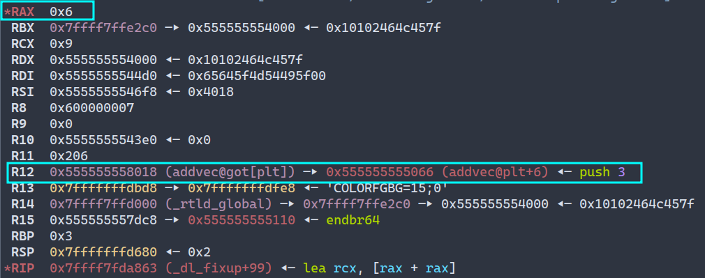

让我们观察一下.rela.got 表 第四项的info 在移位之后就是 6


用print验证一下


我们知道st_name 存储的是到`addvec` 函数的名字在`.dynstr`节中的偏移

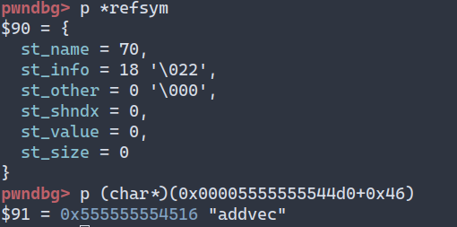

（注意 0x46 = 70)

> p (char*)(.dynstr的地址+0x46)

**我们就得到了我们需要调用的函数 addvec 的名字！**

注意，上面那行代码有这么一个声明 `DT_JMPREL` 让我们再来看下.rela.pot节的内容

`R_X86_64_JUMP_SLOT` 是一个重定位类型，用于 x86-64 架构上的 ELF 文件。它表示一个过程链接表（PLT）条目的重定位，用于在运行时解析动态链接库中的函数地址。

在运行时链接器处理重定位时，它会查找 `R_X86_64_JUMP_SLOT` 类型的重定位项，并将其对应的 PLT 条目更新为指向目标函数的地址。这样，在程序调用该函数时，它将通过 PLT 条目跳转到正确的地址。

```c
  /* Sanity check that we're really looking at a PLT relocation.  */
  assert (ELFW(R_TYPE)(reloc->r_info) == ELF_MACHINE_JMP_SLOT);
```

这一行代码检查重定位项是否为 `R_X86_64_JUMP_SLOT` 类型。如果不是，则会触发断言失败。对应的就是下面的这段汇编代码。

```nasm
.下面这两条指令用来验证
cmp r8d, 7
jne _dl_fixup+652i
```

紧接着那条if语句大多都是验证，我们的这个过程进入了if语句，最终停留在下方这段代码中。

```c
        result = _dl_lookup_symbol_x (strtab + sym->st_name, l, &sym, l->l_scope,
           version, ELF_RTYPE_CLASS_PLT, flags, NULL);
        // version = 0x0
        // ELF_RTYPE_CLASS_PLT = 0x1
        // flags = 0x1

        /* Currently result contains the base load address (or link map)
           of the object that defines sym.  Now add in the symbol
           offset.  */
        value = DL_FIXUP_MAKE_VALUE (result,
                SYMBOL_ADDRESS (result, sym, false));
```

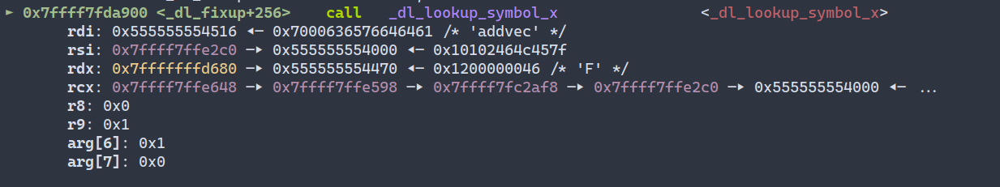

_dl_lookup_symbol_x() 这个函数对我们传入的 `addvec` 字符串进行hash运算，并将得到的结果和我们传入的参数传入到 _dl_lookup_x() 函数中，这个函数才是真正计算地址的函数。

最终将得到的函数地址写入到在上面得到的 .got.plt 节中addvec所在的位置（也就是 0x555555558018），并再次调用addvec，这次的地址已经是addvec的真实地址了，所以调用成功。

## 定义

### _dl_lookup_symbol_x()

[CodeBrowser](https://codebrowser.dev/glibc/glibc/elf/dl-lookup.c.html#_dl_lookup_symbol_x)

### SYMBOL_ADDRESS

```c
/* Calculate the address of symbol REF using the base address
   from map MAP,
   if non-NULL.  Don't check for NULL map if MAP_SET is TRUE.  */
#define SYMBOL_ADDRESS(map, ref, map_set)                \
  ((ref) == NULL ? 0                            \
   : (__glibc_unlikely ((ref)->st_shndx == SHN_ABS) ? 0            \
      : LOOKUP_VALUE_ADDRESS (map, map_set)) + (ref)->st_value)
```

这是SYMBOL_ADDRESS宏的定义，用于计算共享库中符号的地址。该宏有三个参数：一个指向包含符号的模块的链接映射的指针（map），一个指向符号本身的指针（ref），以及一个指示映射参数是否为非NULL的布尔值（map_set）。

宏首先检查ref参数是否为NULL。如果是，则结果为0。如果不是，则宏检查符号（st_shndx）的部分索引是否等于SHN_ABS，这意味着它是一个绝对符号。如果是，则结果为0。如果不是，则宏使用map和map_set参数调用LOOKUP_VALUE_ADDRESS宏，以计算包含符号的模块的基地址。然后将结果与符号的值（st_value）相加，以计算其最终地址。

### DL_FIXUP_

[CodeBrowser](https://codebrowser.dev/glibc/glibc/sysdeps/generic/dl-lookupcfg.h.html#23)

```c
/* The type of the return value of fixup/profile_fixup.  */
#define DL_FIXUP_VALUE_TYPE ElfW(Addr)
/* Construct a value of type DL_FIXUP_VALUE_TYPE from a code address
   and a link map.  */
#define DL_FIXUP_MAKE_VALUE(map, addr) (addr)
/* Extract the code address from a value of type DL_FIXUP_MAKE_VALUE.
 */
#define DL_FIXUP_VALUE_CODE_ADDR(value) (value)
#define DL_FIXUP_VALUE_ADDR(value) (value)
#define DL_FIXUP_ADDR_VALUE(addr) (addr)
#define DL_FIXUP_BINDNOW_ADDR_VALUE(addr) (addr)
#define DL_FIXUP_BINDNOW_RELOC(value, new_value, st_value) \
  (*value) = st_value;
```

### D_PTR()

[CodeBrowser](https://codebrowser.dev/glibc/glibc/sysdeps/generic/ldsodefs.h.html#89)

```c
/* All references to the value of l_info[DT_PLTGOT],
  l_info[DT_STRTAB], l_info[DT_SYMTAB], l_info[DT_RELA],
  l_info[DT_REL], l_info[DT_JMPREL], and l_info[VERSYMIDX (DT_VERSYM)]
  have to be accessed via the D_PTR macro.  The macro is needed since for
  most architectures the entry is already relocated - but for some not
  and we need to relocate at access time.  */
#define D_PTR(map, i) \
  ((map)->i->d_un.d_ptr + (dl_relocate_ld (map) ? 0 : (map)->l_addr))
```

### elf.h

elf.h文件中有许多我们下方我们展示的定义，强烈建议您去研究下这个文件。

[Github链接](https://github.com/torvalds/linux/blob/master/include/uapi/linux/elf.h) [CodeBrowser](https://codebrowser.dev/glibc/glibc/elf/elf.h.html#861)

### _dl_fixup

[CodeBrowser链接](https://codebrowser.dev/glibc/glibc/elf/dl-runtime.c.html)

```c
/* This function is called through a special trampoline from the PLT the
   first time each PLT entry is called.  We must perform the relocation
   specified in the PLT of the given shared object, and return the resolved
   function address to the trampoline, which will restart the original call
   to that address.  Future calls will bounce directly from the PLT to the
   function.  */

DL_FIXUP_VALUE_TYPE
    attribute_hidden __attribute ((noinline)) DL_ARCH_FIXUP_ATTRIBUTE
_dl_fixup (
# ifdef ELF_MACHINE_RUNTIME_FIXUP_ARGS
        ELF_MACHINE_RUNTIME_FIXUP_ARGS,
# endif
        struct link_map *l, ElfW(Word) reloc_arg)
{
    const ElfW(Sym) *const symtab
        = (const void *) D_PTR (l, l_info[DT_SYMTAB]);
    const char *strtab = (const void *) D_PTR (l, l_info[DT_STRTAB]);
    const uintptr_t pltgot = (uintptr_t) D_PTR (l, l_info[DT_PLTGOT]);
    const PLTREL *const reloc
        = (const void *) (D_PTR (l, l_info[DT_JMPREL])
                + reloc_offset (pltgot, reloc_arg));
    const ElfW(Sym) *sym = &symtab[ELFW(R_SYM) (reloc->r_info)];
    const ElfW(Sym) *refsym = sym;
    void *const rel_addr = (void *)(l->l_addr + reloc->r_offset);
    lookup_t result;
    DL_FIXUP_VALUE_TYPE value;
    /* Sanity check that we're really looking at a PLT relocation.  */
    assert (ELFW(R_TYPE)(reloc->r_info) == ELF_MACHINE_JMP_SLOT);
    /* Look up the target symbol.  If the normal lookup rules are not
       used don't look in the global scope.  */
    /* 查找目标符号，如果常规查找不能使用就不在全局符号表中 */
    if (__builtin_expect (ELFW(ST_VISIBILITY) (sym->st_other), 0) == 0)
    {
        const struct r_found_version *version = NULL;
        if (l->l_info[VERSYMIDX (DT_VERSYM)] != NULL)
        {
            const ElfW(Half) *vernum =
                (const void *) D_PTR (l, l_info[VERSYMIDX (DT_VERSYM)]);
            ElfW(Half) ndx = vernum[ELFW(R_SYM) (reloc->r_info)] & 0x7fff;
            version = &l->l_versions[ndx];
            if (version->hash == 0)
                version = NULL;
        }
        /* We need to keep the scope around so do some locking.  This is
           not necessary for objects which cannot be unloaded or when
           we are not using any threads (yet).  */
        int flags = DL_LOOKUP_ADD_DEPENDENCY;
        if (!RTLD_SINGLE_THREAD_P)
        {
            THREAD_GSCOPE_SET_FLAG ();
            flags |= DL_LOOKUP_GSCOPE_LOCK;
        }
#ifdef RTLD_ENABLE_FOREIGN_CALL
        RTLD_ENABLE_FOREIGN_CALL;
#endif
        result = _dl_lookup_symbol_x (strtab + sym->st_name, l, &sym, l->l_scope,
                version, ELF_RTYPE_CLASS_PLT, flags, NULL);
        /* We are done with the global scope.  */
        if (!RTLD_SINGLE_THREAD_P)
            THREAD_GSCOPE_RESET_FLAG ();
#ifdef RTLD_FINALIZE_FOREIGN_CALL
        RTLD_FINALIZE_FOREIGN_CALL;
#endif
        /* Currently result contains the base load address (or link map)
           of the object that defines sym.  Now add in the symbol
           offset.  */
        value = DL_FIXUP_MAKE_VALUE (result,
                SYMBOL_ADDRESS (result, sym, false));
    }
    else
    {
        /* We already found the symbol.  The module (and therefore its load
           address) is also known.  */
        value = DL_FIXUP_MAKE_VALUE (l, SYMBOL_ADDRESS (l, sym, true));
        result = l;
    }
    /* And now perhaps the relocation addend.  */
    value = elf_machine_plt_value (l, reloc, value);
    if (sym != NULL
            && __builtin_expect (ELFW(ST_TYPE) (sym->st_info) == STT_GNU_IFUNC, 0))
        value = elf_ifunc_invoke (DL_FIXUP_VALUE_ADDR (value));
#ifdef SHARED
    /* Auditing checkpoint: we have a new binding.  Provide the auditing
       libraries the possibility to change the value and tell us whether further
       auditing is wanted.
       The l_reloc_result is only allocated if there is an audit module which
       provides a la_symbind.  */
    if (l->l_reloc_result != NULL)
    {
        /* This is the address in the array where we store the result of previous
           relocations.  */
        struct reloc_result *reloc_result
            = &l->l_reloc_result[reloc_index (pltgot, reloc_arg, sizeof (PLTREL))];
        unsigned int init = atomic_load_acquire (&reloc_result->init);
        if (init == 0)
        {
            _dl_audit_symbind (l, reloc_result, sym, &value, result);
            /* Store the result for later runs.  */
            if (__glibc_likely (! GLRO(dl_bind_not)))
            {
                reloc_result->addr = value;
                /* Guarantee all previous writes complete before init is
                   updated.  See CONCURRENCY NOTES below.  */
                atomic_store_release (&reloc_result->init, 1);
            }
        }
        else
            value = reloc_result->addr;
    }
#endif
    /* Finally, fix up the plt itself.  */
    if (__glibc_unlikely (GLRO(dl_bind_not)))
        return value;
    return elf_machine_fixup_plt (l, result, refsym, sym, reloc, rel_addr, value);
}
```

### Elf64_Sym

符号表是由汇编器构造的，使用编译器输出到汇编语言.s文件的符号。.symtab 节中包含ELF符号表。这张符号表包含一个条目的数组。

```c
typedef struct {
    Elf64_Word st_name; // 4 B (B for bytes)
    unsigned char st_info; // 1 B
    unsigned char st_other; // 1 B
    Elf64_Half st_shndx; // 2 B
    Elf64_Addr st_value; // 8 B
    Elf64_Xword st_size; // 8 B
} Elf64_Sym;
```

- `st_name` : .strtab 表中的字节偏移。

- `st_value`: 给出与符号相关联的数值，具体取值依赖于上下文，可能是一个正常的数值、一个地址等等。
  
  - 对于可重定位目标文件(xxx.o)，value是距定义目标的节的起始位置地址的偏移。
  
  - 对于可执行目标文件，value是一个绝对的运行时地址。

- `st_size`: 目标的大小(以字节为单位)。

- `st_info`: 给出符号的类型和绑定属性。

- `st_shndx` : 如果符号定义在该文件中，那么该成员为符号所在节 **在节区头部表中的下标**；如果符号不在本目标文件中，或者对于某些特殊的符号，该成员具有一些特殊含义。

### Elf64_Rela

`Elf64_Rela` 是一个结构体，用于表示重定位表项。它的定义如下：

```c
typedef struct {
    Elf64_Addr r_offset;  // Address
    Elf64_Xword r_info;   // Relocation type and symbol index
    Elf64_Sxword r_addend; // Addend
} Elf64_Rela;
```

每个成员的作用如下：

- `r_offset`：给出重定位所应用的位置。
- `r_info`：给出重定位类型和符号表索引。
- `r_addend`：给出常量加数，用于计算将被填充到可重定位字段中的值。

### Elf64_Dyn

`.dynamic` 是一个`Elf64_Dyn`结构体数组，其中结构体的定义如下

```c
typedef struct {
        Elf32_Sword d_tag;
        union {
                Elf32_Word      d_val;
                Elf32_Addr      d_ptr;
                Elf32_Off       d_off;
        } d_un;
} Elf32_Dyn;//32位程序

typedef struct {
        Elf64_Xword d_tag;
        union {
                Elf64_Xword     d_val;
                Elf64_Addr      d_ptr;
        } d_un;
} Elf64_Dyn;
//  在64位架构中，Elf64_Sxword 和 Elf64_Xword 都是8字节，
//  而 Elf64_Addr 也是8字节。因此，Elf64_Dyn 结构体的大小为16字节。
```

`d_ptr`：表示一个虚拟地址

`d_val`: 需要根据`d_tag` 才能决定表示的意思

`d_tag`：决定这个是什么类别的信息，以及如何解析 `d_un` 内部变量

[动态节 - 链接程序和库指南](https://docs.oracle.com/cd/E26926_01/html/E25910/chapter6-42444.html#scrolltoc) 介绍了所有的`d_tag` 类别，[英文版请点击这个](https://docs.oracle.com/cd/E23824_01/html/819-0690/chapter6-42444.html)

### link_map

[CodeBrowser](https://codebrowser.dev/glibc/glibc/include/link.h.html#link_map::l_info)

下面只是link_map结构的一部分，完整的信息请看上面给出的链接。

```c
struct link_map
{
    /* These first few members are part of the protocol with the debugger.
       This is the same format used in SVR4.  */
    ElfW(Addr) l_addr;        /* Difference between the address in the ELF
                   file and the addresses in memory.  */
    char *l_name;        /* Absolute file name object was found in.  */
    ElfW(Dyn) *l_ld;        /* Dynamic section of the shared object.  */
    struct link_map *l_next, *l_prev; /* Chain of loaded objects.  */
    /* All following members are internal to the dynamic linker.
       They may change without notice.  */
    /* This is an element which is only ever different from a pointer to
       the very same copy of this type for ld.so when it is used in more
       than one namespace.  */
    struct link_map *l_real;

    /* Number of the namespace this link map belongs to.  */
    Lmid_t l_ns;

    struct libname_list *l_libname;
    /* Indexed pointers to dynamic section.
       [0,DT_NUM) are indexed by the processor-independent tags.
       [DT_NUM,DT_NUM+DT_THISPROCNUM) are indexed by the tag minus DT_LOPROC.
       [DT_NUM+DT_THISPROCNUM,DT_NUM+DT_THISPROCNUM+DT_VERSIONTAGNUM) are
       indexed by DT_VERSIONTAGIDX(tagvalue).
       [DT_NUM+DT_THISPROCNUM+DT_VERSIONTAGNUM,
    DT_NUM+DT_THISPROCNUM+DT_VERSIONTAGNUM+DT_EXTRANUM) are indexed by
       DT_EXTRATAGIDX(tagvalue).
       [DT_NUM+DT_THISPROCNUM+DT_VERSIONTAGNUM+DT_EXTRANUM,
    DT_NUM+DT_THISPROCNUM+DT_VERSIONTAGNUM+DT_EXTRANUM+DT_VALNUM) are
       indexed by DT_VALTAGIDX(tagvalue) and
       [DT_NUM+DT_THISPROCNUM+DT_VERSIONTAGNUM+DT_EXTRANUM+DT_VALNUM,
    DT_NUM+DT_THISPROCNUM+DT_VERSIONTAGNUM+DT_EXTRANUM+DT_VALNUM+DT_ADDRNUM)
       are indexed by DT_ADDRTAGIDX(tagvalue), see <elf.h>.  */
    ElfW(Dyn) *l_info[DT_NUM + DT_THISPROCNUM + DT_VERSIONTAGNUM
              + DT_EXTRANUM + DT_VALNUM + DT_ADDRNUM];
    const ElfW(Phdr) *l_phdr;    /* Pointer to program header table in core.  */
    ElfW(Addr) l_entry;        /* Entry point location.  */
    ElfW(Half) l_phnum;        /* Number of program header entries.  */
    ElfW(Half) l_ldnum;        /* Number of dynamic segment entries.  */

    ......

}
```

### _dl_runtime_resolve_xsavec

```nasm
endbr64
push   rbx
mov    rbx,rsp
and    rsp,0xffffffffffffffc0
sub    rsp,QWORD PTR [rip+0x1ffad]        # 0x7ffff7ffcc70 <_rtld_global_ro+432>
mov    QWORD PTR [rsp],rax
mov    QWORD PTR [rsp+0x8],rcx
mov    QWORD PTR [rsp+0x10],rdx
mov    QWORD PTR [rsp+0x18],rsi
mov    QWORD PTR [rsp+0x20],rdi
mov    QWORD PTR [rsp+0x28],r8
mov    QWORD PTR [rsp+0x30],r9
mov    eax,0xee
xor    edx,edx
mov    QWORD PTR [rsp+0x250],rdx
mov    QWORD PTR [rsp+0x258],rdx
mov    QWORD PTR [rsp+0x260],rdx
mov    QWORD PTR [rsp+0x268],rdx
mov    QWORD PTR [rsp+0x270],rdx
mov    QWORD PTR [rsp+0x278],rdx
xsavec [rsp+0x40]
mov    rsi,QWORD PTR [rbx+0x10]
mov    rdi,QWORD PTR [rbx+0x8]
call   0x7ffff7fda800 <_dl_fixup>
mov    r11,rax
mov    eax,0xee
xor    edx,edx
xrstor [rsp+0x40]
mov    r9,QWORD PTR [rsp+0x30]
mov    r8,QWORD PTR [rsp+0x28]
mov    rdi,QWORD PTR [rsp+0x20]
mov    rsi,QWORD PTR [rsp+0x18]
mov    rdx,QWORD PTR [rsp+0x10]
mov    rcx,QWORD PTR [rsp+0x8]
mov    rax,QWORD PTR [rsp]
mov    rsp,rbx
mov    rbx,QWORD PTR [rsp]
add    rsp,0x18
jmp    r11
```

### dl_relocate_ld

[CodeBrowser](https://codebrowser.dev/glibc/glibc/sysdeps/generic/ldsodefs.h.html#71)

```c
static inline bool
dl_relocate_ld (const struct link_map *l)
{
  /* Don't relocate dynamic section if it is readonly  */
        /* 如果两个有任意一个是真的，那么这个就返回0 */
        // DL_RO_DYN_SECTION 是一个宏，它用于确定动态链接器是
        // 否需要在访问某些动态节的地址时进行重定位。如果定义
        // 了 DL_RO_DYN_SECTION，则 D_PTR 宏会在返回地址时
        // 加上 l_addr 字段的值，否则直接返回地址。
  return !(l->l_ld_readonly || DL_RO_DYN_SECTION);
}
```

[DL_RO_DYN_SECTION](https://sourceware.org/pipermail/glibc-cvs/2021q3/075053.html)

### l_info 的详细信息

[CodeBrowser](https://codebrowser.dev/glibc/glibc/elf/elf.h.html#860)

您可以通过查看索引来看到l_info每个成员的作用。  

```c
/* Legal values for d_tag (dynamic entry type).  */
#define DT_NULL        0        /* Marks end of dynamic section */
#define DT_NEEDED    1        /* Name of needed library */
#define DT_PLTRELSZ    2        /* Size in bytes of PLT relocs */
#define DT_PLTGOT    3        /* Processor defined value */
#define DT_HASH        4        /* Address of symbol hash table */
#define DT_STRTAB    5        /* Address of string table */
#define DT_SYMTAB    6        /* Address of symbol table */
#define DT_RELA        7        /* Address of Rela relocs */
#define DT_RELASZ    8        /* Total size of Rela relocs */
#define DT_RELAENT    9        /* Size of one Rela reloc */
#define DT_STRSZ    10        /* Size of string table */
#define DT_SYMENT    11        /* Size of one symbol table entry */
#define DT_INIT        12        /* Address of init function */
#define DT_FINI        13        /* Address of termination function */
#define DT_SONAME    14        /* Name of shared object */
#define DT_RPATH    15        /* Library search path (deprecated) */
#define DT_SYMBOLIC    16        /* Start symbol search here */
#define DT_REL        17        /* Address of Rel relocs */
#define DT_RELSZ    18        /* Total size of Rel relocs */
#define DT_RELENT    19        /* Size of one Rel reloc */
#define DT_PLTREL    20        /* Type of reloc in PLT */
#define DT_DEBUG    21        /* For debugging; unspecified */
#define DT_TEXTREL    22        /* Reloc might modify .text */
#define DT_JMPREL    23        /* Address of PLT relocs */
#define    DT_BIND_NOW    24        /* Process relocations of object */
#define    DT_INIT_ARRAY    25        /* Array with addresses of init fct */
#define    DT_FINI_ARRAY    26        /* Array with addresses of fini fct */
#define    DT_INIT_ARRAYSZ    27        /* Size in bytes of DT_INIT_ARRAY */
#define    DT_FINI_ARRAYSZ    28        /* Size in bytes of DT_FINI_ARRAY */
#define DT_RUNPATH    29        /* Library search path */
#define DT_FLAGS    30        /* Flags for the object being loaded */
#define DT_ENCODING    32        /* Start of encoded range */
#define DT_PREINIT_ARRAY 32        /* Array with addresses of preinit fct*/
#define DT_PREINIT_ARRAYSZ 33        /* size in bytes of DT_PREINIT_ARRAY */
#define DT_SYMTAB_SHNDX    34        /* Address of SYMTAB_SHNDX section */
#define    DT_NUM        35        /* Number used */
#define DT_LOOS        0x6000000d    /* Start of OS-specific */
#define DT_HIOS        0x6ffff000    /* End of OS-specific */
#define DT_LOPROC    0x70000000    /* Start of processor-specific */
#define DT_HIPROC    0x7fffffff    /* End of processor-specific */
#define    DT_PROCNUM    DT_MIPS_NUM    /* Most used by any processor */
```

### reloc_offset

```c
static inline uintptr_t reloc_offset (uintptr_t plt0, uintptr_t pltn)
{
   return pltn * sizeof (ElfW(Rela));
}
```
