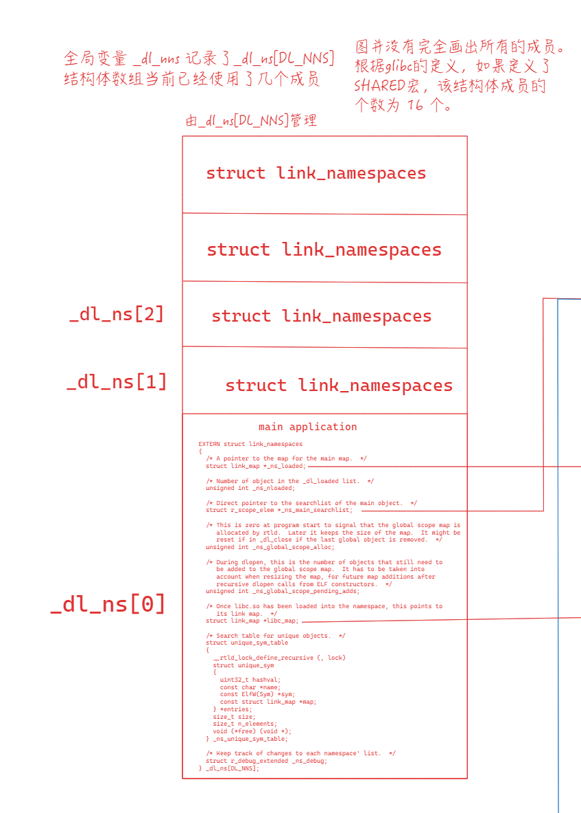
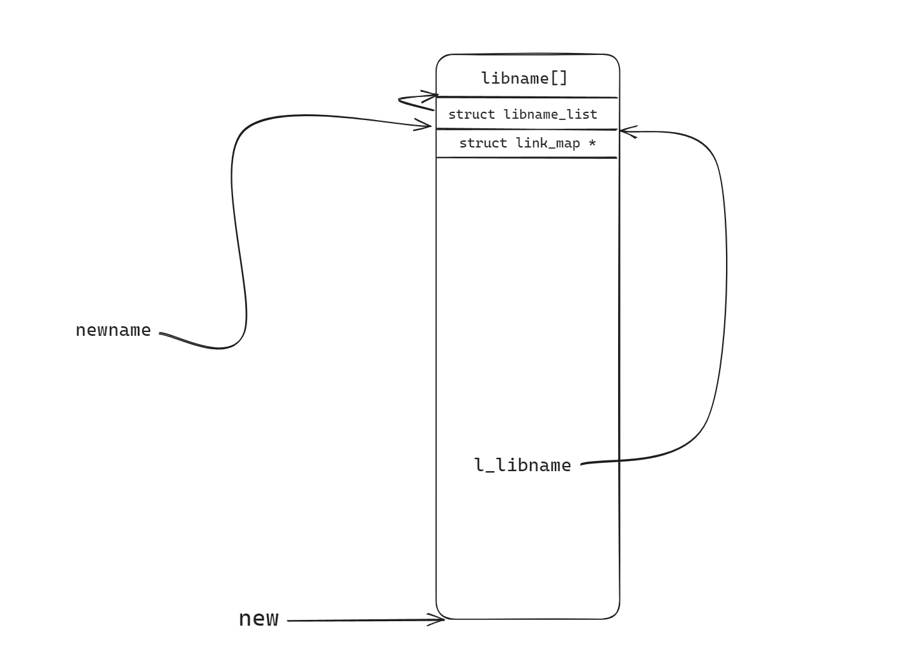
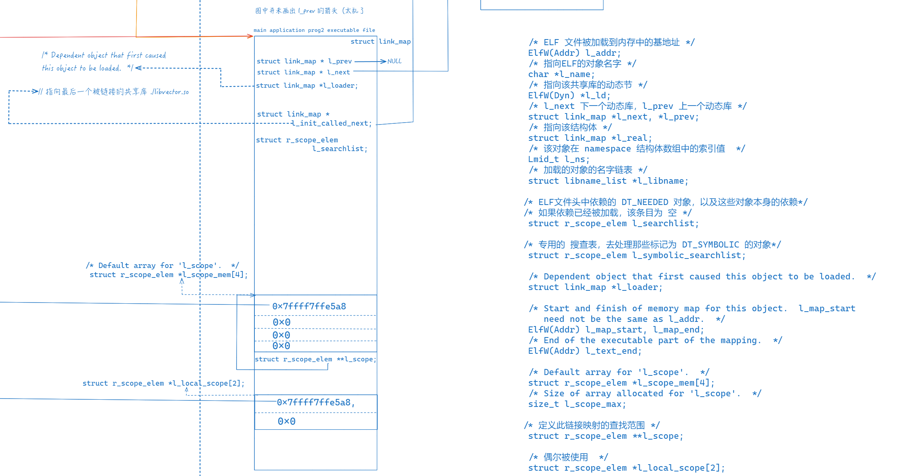

# 链接与加载

## 基础部分

### 编译过程

下面的文件作为示例

**main.c**

```c
/*    main.c    */

#include "vector.h"
#define MAX 2

int sum(int *a, int n);
int x[MAX] = {1, 2};
int y[MAX] = {3, 4};
int z[MAX];
long bss;

int main(){
        addvec(x, y, z, MAX);
        bss = sum(z, MAX);
        return bss;
}
```

**vector.h**

```c
/*    vector.h    */

void addvec(int *x, int *y, int *z, int n);
void multvec(int *x, int *y, int *z, int n);
```

**multvec.c**

```c
/* multvec.c */

int multcnt = 0;
void multvec(int *x, int *y, int *z, int n){
    int i;
    multcnt++;
    for (i = 0; i < n; i++)
        z[i] = x[i] * y[i];
}
```

**addvec.c**

```c
/*    addvec.c    */

int addcnt = 0;

void addvec(int *x, int *y, int *z, int n){
    int i;
    addcnt++;
    for (i = 0; i < n; i++) 
        z[i] = x[i] + y[i];

}
```

**sum.c**

```c
/*    sum.c    */

int sum(int * a, int n){
    int i, s = 0;
    for (i = 0; i < n; i++){
        s += a[i];
    }
    return s;
}
```

**main2.c**

```c
/*  main2.c 后面的几节会使用这个例子    */
#include <dlfcn.h>
#include "vector.h"
#define MAX 2

int x[MAX] = {1, 2};
int y[MAX] = {3, 4};
int z[MAX];
long plusd;
int main(){
        void * handle;
        int (*sum)(int*, int);
        addvec(x, y, z, MAX);
        handle = dlopen("./libsum.so", RTLD_LAZY);
        sum = (int (*)(int*, int))dlsym(handle, "sum");
        plusd = sum(z, MAX);
        dlclose(handle);
        return plusd;
}
```

使用下面这条命令来编译这些文件，可以使用 `-v` 选项来查看编译详情。

```bash
gcc -Og -o prog main.c sum.c multvec.c addvec.c
```

同样，也可以使用下面这几条语句来替代。

```bash
cpp main.c main.i && cpp sum.c sum.i && cpp addvec.c addvec.i && cpp multvec.c multvec.i && 
ccl main.i -Og -o main.s && ccl sum.i -Og -o sum.s && ccl addvec.i -Og -o addvec.s && ccl multvec.i -Og -o multvec.s &&  
as -o main.o main.s && as -o sum.o sum.s && as -o addvec.o addvec.s && as -o multvec.o multvec.s && 
ld -o prog main.o sum.o addvec.o multvec.o
```

首先 C预处理器(C preprocessor)，被称为cpp，是一个宏处理器，再C编译器编译程序之前，它会自动的展开源代码的宏，以及将include文件添加进来。它只能被用来处理C，C++，和Objective-C源码文件。

```bash
cpp main.c main.i && cpp sum.c sum.i && cpp addvec.c addvec.i && cpp multvec.c multvec.i
```

所以 `main.i` 的文件内容就变成了如下这样：

```c
# 0 "main.c"
# 0 "<built-in>"
# 0 "<command-line>"
# 1 "/usr/include/stdc-predef.h" 1 3 4
# 0 "<command-line>" 2
# 1 "main.c"
# 1 "vector.h" 1
void addvec(int *x, int *y, int *z, int n);
void multvec(int *x, int *y, int *z, int n);
# 2 "main.c" 2


int sum(int *a, int n);
int x[2] = {1, 2};
int y[2] = {3, 4};
int z[2];
long bss;

int main(){
 addvec(x, y, z, 2);
 bss = sum(z, 2);
 return bss;
}
```

接下来，C编译器(ccl)将main.i翻译成一个汇编文件 main.s 对其他文件也一样。

```bash
ccl main.i -Og -o main.s && ccl sum.i -Og -o sum.s && ccl addvec.i -Og -o addvec.s && ccl multvec.i -Og -o multvec.s 
```

`ccl` 是一个gcc内部的命令，它接受一个经过预处理器的C语言文件，然后将他们转换成汇编代码文件。它只能用来编译C语言，对于其他语言则有不同的内部命令。比如对于C++语言，GCC使用 cclplus 命令。
可以使用如下的命令来查看gcc的一些内部命令

```bash
linux> tree -if /usr/libexec/gcc
/usr/libexec/gcc
/usr/libexec/gcc/x86_64-linux-gnu
/usr/libexec/gcc/x86_64-linux-gnu/13
/usr/libexec/gcc/x86_64-linux-gnu/13/cc1
/usr/libexec/gcc/x86_64-linux-gnu/13/cc1plus
/usr/libexec/gcc/x86_64-linux-gnu/13/collect2
/usr/libexec/gcc/x86_64-linux-gnu/13/g++-mapper-server
/usr/libexec/gcc/x86_64-linux-gnu/13/liblto_plugin.so
/usr/libexec/gcc/x86_64-linux-gnu/13/lto1
/usr/libexec/gcc/x86_64-linux-gnu/13/lto-wrapper
```

接着 汇编器(as)会将汇编文件翻译成一个**可重定位**目标文件。

```
as -o main.o main.s && as -o sum.o sum.s && as -o addvec.o addvec.s && as -o multvec.o multvec.s  
```

可以使用 objdump 工具来查看这些文件的内容。

```
linux> objdump -d main.o

main.o:     file format elf64-x86-64


Disassembly of section .text:

0000000000000000 <main>:
   0:   53                      push   %rbx
   1:   b9 02 00 00 00          mov    $0x2,%ecx
   6:   48 8d 1d 00 00 00 00    lea    0x0(%rip),%rbx        # d <main+0xd>
   d:   48 89 da                mov    %rbx,%rdx
  10:   48 8d 35 00 00 00 00    lea    0x0(%rip),%rsi        # 17 <main+0x17>
  17:   48 8d 3d 00 00 00 00    lea    0x0(%rip),%rdi        # 1e <main+0x1e>
  1e:   e8 00 00 00 00          call   23 <main+0x23>
  23:   be 02 00 00 00          mov    $0x2,%esi
  28:   48 89 df                mov    %rbx,%rdi
  2b:   e8 00 00 00 00          call   30 <main+0x30>
  30:   48 63 d0                movslq %eax,%rdx
  33:   48 89 15 00 00 00 00    mov    %rdx,0x0(%rip)        # 3a <main+0x3a>
  3a:   5b                      pop    %rbx
  3b:   c3                      ret
```

对于一些需要跳转的指令，比如`call`指令，`1e:   e8 00 00 00 00          call   23 <main+0x23>`，可以看到它的操作数为 `00 00 00 00`。这些二进制文件并不能被执行，需要链接器填入这些地址。

接着，链接器程序`ld`将`main.o`, `sum.o`, `addvec.o`, `multvec.o`以及一些必要的系统目标文件 (比如crti.o,crtbegin.o, crtend.o crtn.o等一些在执行main之前执行的代码的可重定位文件，以及一些运行时需要的库，比如C标准库，这些暂时不深入探讨，可以看下面的链接 **How Initialization Functions Are Handled** ) 组合起来，创建一个可执行的目标文件 prog

```
ld -o prog main.o sum.o addvec.o multvec.o
```

当执行该文件的时候，操作系统会调用一个叫做加载器(loader)的函数(比如Linux系统库里面的 execve 函数)。将可执行文件的代码和数据复制到内存，然后跳转到程序的入口地址。

### 静态链接

### 动态链接

## 进阶部分

接下来重新编译我们的示例

```bash
gcc -shared -fpic -o libsum.so sum.c && 
gcc -shared -fpic -o libvector.so addvec.c multvec.c &&
gcc -Og -g -z lazy -fno-stack-protector -o prog2 main2.c ./libvector.so
```

- `-shared` 选项告诉gcc我们需要编译一个共享库。
- `-fpic` 选项指定强制使用位置无关代码(Position-Independent Code (PIC))。
- `-z lazy` 选项告诉我们的可执行文件强制使用延迟绑定。
- `-fno-stack-protector` 选项告诉gcc禁用栈保护，这个选项无关紧要，不过如果你不想让.got节出现其他信息的话，可以选择开启这个选项。

可执行文件，动态链接库他们的区别并不是很大。Linux使用了一种 `link_map` 的结构体来存储它们的信息，并通过一个全局的_dl_ns结构体数组来管理进程的已加载的对象(Windows上称为 '模块')的信息。理解的这些结构体的作用就能很容易的明白Linux是如何管理这些对象的，不幸的是，这些结构体比较复杂，本节并不会非常详细的介绍每个结构体的每个成员，只会将精力放在相对比较重要的成员上，当然啦，如果有兴趣，您可以下载glibc的源码自己分析。本文档使用的是 glibc 2.38 版本。

link_map 结构体定义: [struct link_map](https://codebrowser.dev/glibc/glibc/include/link.h.html#link_map)
在`./glibc/include/link.h`文件中同样可以找到 link_map 结构体的定义。

### dlopen源码分析

这是一张非常重要的图(自己画的，如果有误及时联系我更正，仓库也给出了图层源文件，可以自己修改导出)，GNU/Linux管理对象的逻辑基本上如下图所示(还有很多细节，不过碍于本人水平，时间等其他因素，只能做到这里了。)


下面展示了`dlopen`函数原型

```c
void *
___dlopen (const char *file, int mode)
{
  return __dlopen (file, mode, RETURN_ADDRESS (0));
}
```

`RETURN_ADDRESS (0) `实际上是我们main函数调用`dlopen`函数的指令的下一条指令的地址。

```c
/* Determine the return address.  */
#define RETURN_ADDRESS(nr) \
  __builtin_extract_return_addr (__builtin_return_address (nr))
```

它传入调用者函数地址，然后调用了`__dlopen`函数

```c
void *
__dlopen (const char *file, int mode, void *dl_caller)
{
  return dlopen_implementation (file, mode, dl_caller);
}
```

继续调用 `dlopen_implementation`

```c
struct dlopen_args
{
  /* The arguments for dlopen_doit.  */
  const char *file;
  int mode;
  /* The return value of dlopen_doit.  */
  void *new;
  /* Address of the caller.  */
  const void *caller;
};

static void *
dlopen_implementation (const char *file, int mode, void *dl_caller)
{
  struct dlopen_args args;
  args.file = file;
  args.mode = mode;
  args.caller = dl_caller;
  return _dlerror_run (dlopen_doit, &args) ? NULL : args.new;
}
```

它调用`_dlerror_run`，并传入了 `dlopen_doit` 和 `args`的地址作为参数，然后调用`GLRO(dl_catch_error)`, 接着调用`__GI__dl_catch_exception`。对于本节课的目的，我们可以忽略`_dlerror_run`函数，同样的，还有`_dl_catch_error`，`__GI__dl_catch_exception`还有将会遇到的其他类似的函数，我们同样进行忽略，下面再次遇到类似的函数就不再过多赘述了。

```c
int
_dlerror_run (void (*operate) (void *), void *args){
  // ......
  int errcode = GLRO (dl_catch_error) (&objname, &errstring, &malloced,
                       operate, args);
  // ......
}
```

接着，来到了 `dlopen_doit`

```c
static void
dlopen_doit (void *a)
{
  struct dlopen_args *args = (struct dlopen_args *) a;
  if (args->mode & ~(RTLD_BINDING_MASK | RTLD_NOLOAD | RTLD_DEEPBIND
             | RTLD_GLOBAL | RTLD_LOCAL | RTLD_NODELETE
             | __RTLD_SPROF))
    _dl_signal_error (0, NULL, NULL, _("invalid mode parameter"));
  args->new = GLRO(dl_open) (args->file ?: "", args->mode | __RTLD_DLOPEN,
                 args->caller,
                 args->file == NULL ? LM_ID_BASE : NS,
                 __libc_argc, __libc_argv, __environ);
}
```

传入的变量`a`指针记录了一些信息供后面的函数使用。

```
{
  // 指向目标库名字的指针
  file = 0x555555556004 "./libsum.so",
  // mode RTLD_LAZY
  mode = 1,
  // 应该指向新link_map对象的地址，不过我不知道为什么会指向.got.plt节的 y 区段
  new = 0x555555558030 <y>,
  // 调用dlopen函数的下一条指令的地址
  caller = 0x5555555551a2 <main+57>
}
```

下面展示了 `.got.plt` 节的内容，不过我也不明白，不过不影响后面的分析。

```
0x555555557fe8: 0x0000000000003dd0
0x555555557ff0: 0x00007ffff7ffe2d0
0x555555557ff8: 0x00007ffff7fdd300
0x555555558000 <addvec@got.plt>:        0x00007ffff7fbf0f9
0x555555558008 <dlopen@got.plt>:        0x00007ffff7e49740
0x555555558010 <dlsym@got.plt>: 0x0000555555555056
0x555555558018 <dlclose@got.plt>:       0x0000555555555066
0x555555558020: 0x0000000000000000
0x555555558028: 0x0000555555558028
0x555555558030 <y>:     0x0000000400000003
0x555555558038 <x>:     0x0000000200000001
0x555555558040 <completed.0>:   0x0000000000000000
0x555555558048 <plusd>: 0x0000000000000000
0x555555558050 <z>:     0x0000000600000004
0x555555558058: 0x0000000000000000
0x555555558060: 0x0000000000000000
```

其中

```c
/* Internally used flag.  */
#define __RTLD_DLOPEN    0x80000000
```

可以看到它进行了简单的错误判断之后就调用了`_dl_open`函数。

```c
// 原型
void *
_dl_open (const char *file, int mode, const void *caller_dlopen, Lmid_t nsid,
      int argc, char *argv[], char *env[])
//  传入_dl_open 的参数
/*  _dl_open (file=0x555555556004 "./libsum.so", mode=-2147483647,
    caller_dlopen=0x5555555551a2 <main+57>, nsid=-2, argc=1, 
    argv=0x7fffffffe2b8, env=0x7fffffffe2c8) at ./elf/dl-open.c:825
*/
```

下面展示了 `_dl_open`函数的开头部分。

```c
  if ((mode & RTLD_BINDING_MASK) == 0)
    /* One of the flags must be set.  */
    _dl_signal_error (EINVAL, file, NULL, N_("invalid mode for dlopen()"));
  // ......
  if (__glibc_unlikely (nsid == LM_ID_NEWLM))
  {
    /* Find a new namespace.  */
    for (nsid = 1; DL_NNS > 1 && nsid < GL(dl_nns); ++nsid)
      if (GL(dl_ns)[nsid]._ns_loaded == NULL)
        break;
    if (__glibc_unlikely (nsid == DL_NNS))
    {
      /* No more namespace available.  */
      __rtld_lock_unlock_recursive (GL(dl_load_lock));
      _dl_signal_error (EINVAL, file, NULL, N_("\
no more namespaces available for dlmopen()"));
    }
    else if (nsid == GL(dl_nns))
    {
      __rtld_lock_initialize (GL(dl_ns)[nsid]._ns_unique_sym_table.lock);
      ++GL(dl_nns);
    }
      GL(dl_ns)[nsid].libc_map = NULL;
      _dl_debug_update (nsid)->r_state = RT_CONSISTENT;
  }

  // ......
```

可以看到glibc内部做了非常多的错误处理，来保证函数可以正常的运行。虽然在调试过程中我们并不会进入这个分支，不过还是需要提一点东西。

值得注意的是 `GL(dl_nns)`，该宏的定义如下：

```c
# define GL(name) _##name
```

所以`GL(dl_nns) `其实就是 `_dl_nns`，它是一个全局变量，用来决定 `struct link_namespace` 结构体数组的大小。该错误处理为`nsid`寻找一个新的namespace位置，如果`nsid == DL_NNS`，出现错误，结束函数。如果 `nsid == _dl_nns`，就把_dl_nns值+1。
再获得一个新的namespace位置后，就对该结构体初始化。

```c
/* Non-shared code has no support for multiple namespaces.  */
#ifdef SHARED
# define DL_NNS 16
#else
# define DL_NNS 1
#endif
```

```c
GL(dl_ns)[nsid].libc_map = NULL;
```



这段看不懂没关系，只是先留个印象，由于 `struct link_namespace` 结构体比较复杂，现在只是先留个印象。等看到后面自然就明白了。

```c
struct dl_open_args args;
args.file = file;
args.mode = mode;
args.caller_dlopen = caller_dlopen;
args.map = NULL;
args.nsid = nsid;
/* args.libc_already_loaded is always assigned by dl_open_worker
    (before any explicit/non-local returns).  */
args.argc = argc;
args.argv = argv;
args.env = env;
// ......
int errcode = _dl_catch_exception (&exception, dl_open_worker, &args);
// ......
```

```c
struct dl_open_args
{
  const char *file;
  int mode;
  /* This is the caller of the dlopen() function.  */
  const void *caller_dlopen;
  struct link_map *map;
  /* Namespace ID.  */
  Lmid_t nsid;
  /* Original value of _ns_global_scope_pending_adds.  Set by
     dl_open_worker.  Only valid if nsid is a real namespace
     (non-negative).  */
  unsigned int original_global_scope_pending_adds;
  /* Set to true by dl_open_worker if libc.so was already loaded into
     the namespace at the time dl_open_worker was called.  This is
     used to determine whether libc.so early initialization has
     already been done before, and whether to roll back the cached
     libc_map value in the namespace in case of a dlopen failure.  */
  bool libc_already_loaded;
  /* Set to true if the end of dl_open_worker_begin was reached.  */
  bool worker_continue;
  /* Original parameters to the program and the current environment.  */
  int argc;
  char **argv;
  char **env;
};
```

在 `_dl_open` 中，新建了一个 `struct dl_open_args` 结构体对象 `args`，然后为这个对象赋值，接着调用 `dl_open_work`继续处理。args这个对象同样非常重要，需要关注的是 `Lmid_t nsid` 和 将指向 `libsum.so` 对象的 link_map 结构体指针 map。

```c
// /* Type for namespace indices.  */
// typedef long int Lmid_t;

struct link_map *map;
/* Namespace ID.  */
Lmid_t nsid;
```

现在，该来到 `dl_open_work` 函数了。

```c
static void
dl_open_worker (void *a)

// ......
  struct dl_open_args *args = a;
  args->worker_continue = false;
  {
    /* Protects global and module specific TLS state.  */
    __rtld_lock_lock_recursive (GL(dl_load_tls_lock));
    struct dl_exception ex;
    int err = _dl_catch_exception (&ex, dl_open_worker_begin, args);
    __rtld_lock_unlock_recursive (GL(dl_load_tls_lock));
    if (__glibc_unlikely (ex.errstring != NULL))
      /* Reraise the error.  */
      _dl_signal_exception (err, &ex, NULL);
  }
  if (!args->worker_continue)
    return;

// ......
```

这段代码写的直戳了当，设置`dl_open_args::worker_contine`的成员为 false，调用 `dl_open_worker_begin` 如果 `dl_open_worker_begin` 的工作并未做完就返回，那么同样直接返回 `dl_open_work`函数。

先来看下 `dl_open_worker_begin` 的定义

```c
static void
dl_open_worker_begin (void *a)
```

```c
  /* Determine the caller's map if necessary.  This is needed in case
     we have a DST, when we don't know the namespace ID we have to put
     the new object in, or when the file name has no path in which
     case we need to look along the RUNPATH/RPATH of the caller.  */
  const char *dst = strchr (file, '$');
  if (dst != NULL || args->nsid == __LM_ID_CALLER
      || strchr (file, '/') == NULL)
    {
      const void *caller_dlopen = args->caller_dlopen;
      /* We have to find out from which object the caller is calling.
     By default we assume this is the main application.  */
      call_map = GL(dl_ns)[LM_ID_BASE]._ns_loaded;
      struct link_map *l = _dl_find_dso_for_object ((ElfW(Addr)) caller_dlopen);
      if (l)
    call_map = l;
      if (args->nsid == __LM_ID_CALLER)
    args->nsid = call_map->l_ns;
    }
```

这段代码注释说的比较详细，将call_map指针指向main程序(也就是我们运行的prog2)的`struct link_map` 结构体的信息。

```c
_dl_find_dso_for_object (const ElfW(Addr) addr)
{
  struct link_map *l;
  /* Find the highest-addressed object that ADDR is not below.  */
  for (Lmid_t ns = 0; ns < GL(dl_nns); ++ns)
    for (l = GL(dl_ns)[ns]._ns_loaded; l != NULL; l = l->l_next)
      if (addr >= l->l_map_start && addr < l->l_map_end
      && (l->l_contiguous
          || _dl_addr_inside_object (l, (ElfW(Addr)) addr)))
    {
      assert (ns == l->l_ns);
      return l;
    }
  return NULL;
}
```

该函数遍历`_dl_ns`结构体数组，然后将传入的参数 `caller_open`(**也就是我们prog2程序main函数调用dlopen的下一条指令**)的地址与映射到内存的对象的起始地址与结束地址进行比对，然后返回匹配成功的对象。

```c
struct link_map{
    // ......
    /* Start and finish of memory map for this object.  l_map_start
       need not be the same as l_addr.  */
    ElfW(Addr) l_map_start, l_map_end;
    // ......
    unsigned int l_contiguous:1; /* Nonzero if inter-segment holes are
        mprotected or if no holes are present at
        all.  */
    // ......
}
```

`(l->l_contiguous || _dl_addr_inside_object (l, (ElfW(Addr)) addr)))` 这段代码进行进一步的检查，感兴趣的可以查看 `glibc/elf/dl-addr-obj.c` 文件，glibc对这里的介绍非常详细。

由于传入的`args->nsid == __LM_ID_CALLER`，所以该条件成立。将 `call_map->l_ns` 赋值给 `args->nsid == 0`。其实就是将main程序在 namespace 的索引赋值给 args->nsid。

```c
  /* The namespace ID is now known.  Keep track of whether libc.so was
     already loaded, to determine whether it is necessary to call the
     early initialization routine (or clear libc_map on error).  */
  args->libc_already_loaded = GL(dl_ns)[args->nsid].libc_map != NULL;
```

如果libc对象被加载，就设置args->libc_already_loaded为1。

```c
  /* Retain the old value, so that it can be restored.  */
  args->original_global_scope_pending_adds
    = GL (dl_ns)[args->nsid]._ns_global_scope_pending_adds;
```

可以看下 `struct link_namespace`的注释，不再赘述
下面展示了此时 args 的信息。

```
{
  指向 "libm.so.6" 字符串
  file = 0x555555556004,
  open 参数
  mode = 0x80000001,
  调用dlopen函数的下一条指令
  caller_dlopen = 0x55555555517b,
  目标对象
  map = 0x0,
  main模块在 全局namespaces 的索引
  nsid = 0x0,

  original_global_scope_pending_adds = 0x0,
  libc_already_loaded = 0x1,
  worker_continue = 0x0,
  argc = 0x1,
  argv = 0x7fffffffe2b8,
  env = 0x7fffffffe2c8
}
```

加载对象。

```c
/* Load the named object.  */
struct link_map *new;
args->map = new = _dl_map_object (call_map, file, lt_loaded, 0,
          mode | __RTLD_CALLMAP, args->nsid);
```

在 `_dl_map_object` 中
首先将 `l` 指向当前的 main 模块，然后遍历 `struct link_map` 链表，查看目标模块是否已经被加载，找到就返回。对于我们的示例，当然是没找到。

```c
  /* Look for this name among those already loaded.  */
  for (l = GL(dl_ns)[nsid]._ns_loaded; l; l = l->l_next)
    {
      /* If the requested name matches the soname of a loaded object,
     use that object.  Elide this check for names that have not
     yet been opened.  */
      if (__glibc_unlikely ((l->l_faked | l->l_removed) != 0))
    continue;
      if (!_dl_name_match_p (name, l))
    {
      const char *soname;
      if (__glibc_likely (l->l_soname_added)
          || l->l_info[DT_SONAME] == NULL)
        continue;
      soname = ((const char *) D_PTR (l, l_info[DT_STRTAB])
            + l->l_info[DT_SONAME]->d_un.d_val);
      if (strcmp (name, soname) != 0)
        continue;
      /* We have a match on a new name -- cache it.  */
      add_name_to_object (l, soname);
      l->l_soname_added = 1;
    }
      /* We have a match.  */
      return l;
    }
```

调整模块名字，不再赘述，这部分可以自己去阅读源码

```c
  /* Give the auditing libraries a chance to change the name before we
     try anything.  */
  /* 此处省略 几百行 */
```

判断是否在其他路径，或者是否在ld缓存，不再赘述。

调用 `_dl_new_object`，为目标模块分配一个新的对象。下面展示了调用`_dl_new_object` 函数时传入的参数：

```
_dl_new_object (realname=realname@entry=0x5555555592a0 "./libsum.so", 
    libname=libname@entry=0x555555556004 "./libsum.so", type=type@entry=2, loader=loader@entry=0x0, 
    mode=mode@entry=-1879048191, nsid=nsid@entry=0) at ./elf/dl-object.c:62
```

```c
  new = (struct link_map *) calloc (sizeof (*new) + audit_space
                    + sizeof (struct link_map *)
                    + sizeof (*newname) + libname_len, 1);
  if (new == NULL)
    return NULL;
  new->l_real = new;
  new->l_symbolic_searchlist.r_list = (struct link_map **) ((char *) (new + 1)
                                + audit_space);
  new->l_libname = newname
    = (struct libname_list *) (new->l_symbolic_searchlist.r_list + 1);
  newname->name = (char *) memcpy (newname + 1, libname, libname_len);
  /* newname->next = NULL;    We use calloc therefore not necessary.  */
  newname->dont_free = 1;
```

```c
#ifdef SHARED
  size_t audit_space = naudit * sizeof (struct auditstate);
#else
# define audit_space 0
#endif
```

```c
/* Information used by audit modules.  For most link maps, this data
   immediate follows the link map in memory.  For the dynamic linker,
   it is allocated separately.  See link_map_audit_state in
   <ldsodefs.h>.  */
struct auditstate
{
  uintptr_t cookie;
  unsigned int bindflags;
};
```

在该函数中，首先为 `struct link_map * new` 申请一块内存，这块内存的大小为 `sizeof(struct link_map)` 用来存储 libsum.so DSO的信息，audit_space虽然不为0，但是我们可以暂时忽略它，所以先不考虑。还分配了一个指向 `struct link_map *` 结构体的指针的大小的内存， `new->l_symbolic_searchlist.r_list` 指向了该地址。`new->l_libname` 跟 `newname` 都指向 新分配的 `struct libname_list`, 该结构体的字符串指针(**libname_list::name**)指向最后分配的那一小块内存。

```c
/* A data structure for a simple single linked list of strings.  */
struct libname_list
  {
    const char *name;        /* Name requested (before search).  */
    struct libname_list *next;    /* Link to next name for this object.  */
    int dont_free;        /* Flag whether this element should be freed
                   if the object is not entirely unloaded.  */
  };
```

下面这个矩形展示了新申请的内存，new->l_libname 和 newname 都指向一个 `struct libname_list`结构体，其中该结构体中的 `libname_list::name` 成员指向`libname[]`



接着

```c
  /* 让l_scope默认使用 l_scope_mem 数组，如果需要更多的条目就动态地申请更大的数组 */
  new->l_scope = new->l_scope_mem;
  new->l_scope_max = sizeof (new->l_scope_mem) / sizeof (new->l_scope_mem[0]);
  /* Counter for the scopes we have to handle.  */
  int idx = 0;
  if (GL(dl_ns)[nsid]._ns_loaded != NULL)
    /* Add the global scope.  */
    // 将我们需要加载的 libsum.so 对象的 l_scope 的第一个成员指向我们prog2程序的
    // DT_NEEDED 列表，也就是 prog2 的 link_map::l_searchlist 地址
    new->l_scope[idx++] = &GL(dl_ns)[nsid]._ns_loaded->l_searchlist;

  /* If we have no loader the new object acts as it.  */
  if (loader == NULL)
    loader = new;
  else
    /* Determine the local scope.  */
    while (loader->l_loader != NULL)
      loader = loader->l_loader;
  /* Insert the scope if it isn't the global scope we already added.  */
  if (idx == 0 || &loader->l_searchlist != new->l_scope[0])
  {
      if ((mode & RTLD_DEEPBIND) != 0 && idx != 0)
      {
        new->l_scope[1] = new->l_scope[0];
        idx = 0;
      }
      new->l_scope[idx] = &loader->l_searchlist;
  }
  new->l_local_scope[0] = &new->l_searchlist;
```

上面这段代码有点绕。
因为我们传入的loader是0x0，所以该对象的loader指向它自己。

如果同时将mode设置 RTLD_DEEPBIND，就会把全局的l_scope的第二个成员(**指向r_scope_elem结构体的指针**)同样设置为第一个成员的值。

将第一个成员的值指向该link_map对象的DT_NEEDED搜查表。并同样初始化l_local_scope成员。

关于这些成员的作用，可以简单看下这个图：



后面代码对于我们的目的不是很重要，有兴趣可以看注释。

```c
      /* Signal that this is a faked entry.  */
      l->l_faked = 1;
      /* Since the descriptor is initialized with zero we do not
         have do this here.
      l->l_reserved = 0; */
      l->l_buckets = &dummy_bucket;
      l->l_nbuckets = 1;
      l->l_relocated = 1;
      /* Enter the object in the object list.  */
      _dl_add_to_namespace_list (l, nsid);
      return l;
```

接着返回新建的struct link_map对象，继续做了一些初始化的工作，接着`_dl_map_object` 函数又调用了 `_dl_add_to_namespace_list`

```c
/* Add the new link_map NEW to the end of the namespace list.  */
void
_dl_add_to_namespace_list (struct link_map *new, Lmid_t nsid)
{
  /* We modify the list of loaded objects.  */
  __rtld_lock_lock_recursive (GL(dl_load_write_lock));
  if (GL(dl_ns)[nsid]._ns_loaded != NULL)
    {
      struct link_map *l = GL(dl_ns)[nsid]._ns_loaded;
      while (l->l_next != NULL)
    l = l->l_next;
      new->l_prev = l;
      /* new->l_next = NULL;   Would be necessary but we use calloc.  */
      l->l_next = new;
    }
  else
    GL(dl_ns)[nsid]._ns_loaded = new;
  ++GL(dl_ns)[nsid]._ns_nloaded;
  new->l_serial = GL(dl_load_adds);

  ++GL(dl_load_adds);

  __rtld_lock_unlock_recursive (GL(dl_load_write_lock));
}
```

该函数比较简单，就是查找在全局变量`_dl_ns` 的结构体中查找我们的运行文件 prog2 的 link_map，将新建的libsum.so库的信息添加到该链表的末尾。如果指向prog2对象的link_map指针为 NULL，就把本来属于 prog2 的位置替换成当前运行的库的对象的link_map位置。将全局变量 _dl_ns中存储的 prog2 的信息中的 _ns_nloaded 结果 + 1。


后面就不说了，该函数返回，退回到 dl_open_worker_begin

```c
  /* This object is directly loaded.  */
  ++new->l_direct_opencount;
```

之后该函数又会做两个事情，加载该对象的依赖，接着进行重定位

```c
void
_dl_relocate_object (struct link_map *l, struct r_scope_elem *scope[],
             int reloc_mode, int consider_profiling)
{
  // 省略一大堆

  /* In case we can protect the data now that the relocations are
     done, do it.  */
  if (l->l_relro_size != 0)
  // 真正进行重定位的工作
    _dl_protect_relro (l);
}
```

然后就回到 `dl_open_work`了

```
新struct link_map 结构体的部分内容如下所示
  l_addr = 0x7ffff7fb9000,
  l_name = 0x5555555592a0,
  l_ld = 0x7ffff7fbce78,
  l_next = 0x0,
  l_prev = 0x7ffff7ffdab0,
  l_real = 0x5555555592c0,
```

这时候对象已经完成了重定位，被加载到了内存中。到这里，基本上整个流程就分析完了！

### dlsym源码分析

## 高阶

### 探究延迟绑定

# References:

## 编译过程

1. **The C Preprocessor** https://gcc.gnu.org/onlinedocs/cpp.pdf
2. **GNU Compiler Collection** https://en.wikipedia.org/wiki/GNU_Compiler_Collection
3. **How Initialization Functions Are Handled** https://gcc.gnu.org/onlinedocs/gccint/Initialization.html

## 静态链接

1. **GNU 链接脚本0 - 链接脚本基本介绍** https://zhuanlan.zhihu.com/p/363308789

## 源代码

1. **glibc elf目录** https://codebrowser.dev/glibc/glibc/elf/